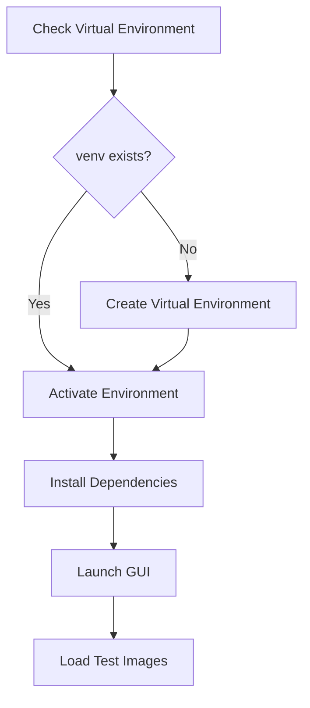
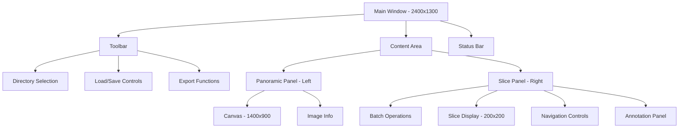
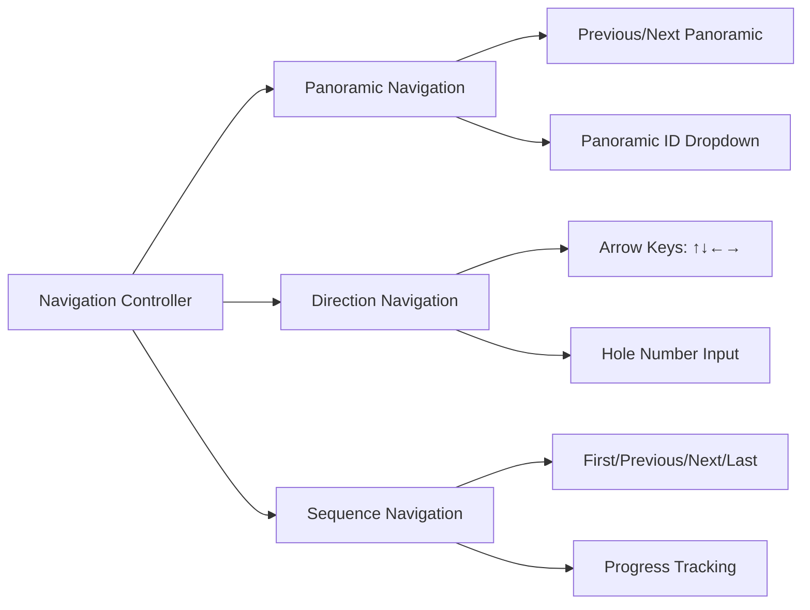
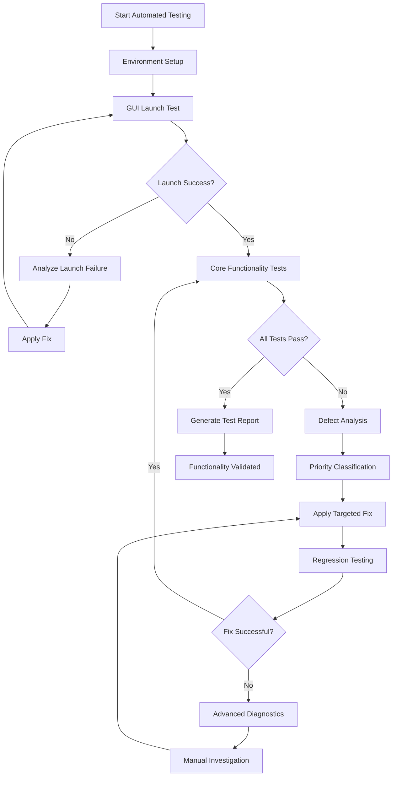
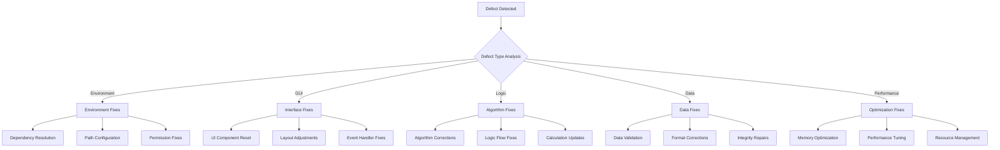

# Panoramic Annotation GUI Testing Design

## Overview

This document outlines a comprehensive testing strategy for the panoramic annotation GUI tool - a specialized annotation review and enhancement system designed for microbial drug sensitivity detection. The tool enables users to:

- Load panoramic images with their corresponding slice images
- Import existing preliminary positive/negative results
- Enhance annotations with detailed microbial characteristics and growth patterns
- Save comprehensive annotation data for ML training
- Review and reload saved annotations for iterative refinement
- Support multi-session annotation workflows with data persistence

Testing will focus on environment activation, GUI functionality, annotation workflow, and data persistence using test panoramic images located at `D:\test\images`.

## Technology Stack & Dependencies

### Core Technologies
- **Python**: 3.x with virtual environment support
- **GUI Framework**: Tkinter with TTK widgets
- **Image Processing**: PIL (Pillow) for image handling
- **Data Models**: Custom annotation models for panoramic datasets

### Key Components
- **PanoramicAnnotationGUI**: Main interface class
- **HoleManager**: 12×10 hole layout management
- **EnhancedAnnotationPanel**: Advanced annotation features
- **PanoramicImageService**: Image processing and handling
- **ConfigFileService**: Configuration management

## Environment Setup & Activation

### Activation Strategy
Based on the startup guide, the following activation sequence will be tested:



### Startup Methods Testing
1. **Automated Scripts** (Recommended)
   - `start_gui.bat` (Windows)
   - `start_gui.sh` (Linux/Mac)

2. **Manual Python Execution**
   - `start_gui.py` - Main startup script
   - `panoramic_annotation_tool.py` - Enhanced compatibility
   - `launch_gui.py` - With dependency checking

### Environment Validation
- Virtual environment activation status
- Dependency installation verification
- Python path configuration
- Module import testing

## GUI Component Architecture

### Main Interface Layout


### Navigation System Architecture


## Automated Testing Framework

### Continuous Testing Strategy



### Automated Test Execution Engine

#### Test Runner Architecture
```python
class AutomatedTestRunner:
    def __init__(self, test_directory="D:\\test\\images"):
        self.test_directory = test_directory
        self.defects = []
        self.fixes_applied = []
        self.test_cycles = 0
        self.max_cycles = 10
    
    def run_continuous_testing(self):
        while self.test_cycles < self.max_cycles:
            cycle_results = self.execute_test_cycle()
            if cycle_results.all_passed:
                break
            self.analyze_and_fix_defects(cycle_results)
            self.test_cycles += 1
```

## Defect Analysis & Resolution Framework

### Automated Defect Classification



### Intelligent Fix Application

#### Priority-Based Resolution
1. **Critical (P0)**: Application crashes, startup failures
2. **High (P1)**: Core functionality broken, data loss risks
3. **Medium (P2)**: Feature malfunctions, performance issues
4. **Low (P3)**: UI cosmetic issues, minor inconsistencies

#### Automated Fix Strategies

##### Environment & Startup Fixes
- **Missing Dependencies**: Auto-install via pip
- **Version Conflicts**: Automatic downgrade/upgrade
- **Path Issues**: Dynamic path resolution
- **Permission Problems**: Automated permission adjustment

##### GUI & Interface Fixes
- **Widget Errors**: Component reinitialization
- **Layout Issues**: Dynamic layout adjustment
- **Event Binding**: Automatic rebinding
- **Display Problems**: Refresh and redraw cycles

##### Logic & Algorithm Fixes
- **Calculation Errors**: Parameter validation and correction
- **Navigation Issues**: Boundary checking and correction
- **State Management**: State synchronization repairs
- **Data Processing**: Input validation and sanitization

##### Performance Optimization
- **Memory Issues**: Garbage collection and cleanup
- **Slow Operations**: Caching and optimization
- **Resource Leaks**: Resource management improvements
- **UI Responsiveness**: Threading and async updates

### Continuous Testing Cycle

#### Test Execution Loop
```python
class ContinuousTester:
    def run_until_functional(self):
        while not self.all_tests_passing():
            # Execute test suite
            results = self.execute_comprehensive_tests()
            
            # Analyze failures
            defects = self.analyze_test_failures(results)
            
            # Apply automated fixes
            for defect in defects:
                fix_applied = self.apply_automated_fix(defect)
                if fix_applied:
                    self.log_fix(defect, fix_applied)
                else:
                    self.escalate_to_manual_review(defect)
            
            # Short pause before retry
            time.sleep(5)
            
            # Increment cycle counter
            self.cycle_count += 1
            
            # Safety break after max cycles
            if self.cycle_count > self.max_cycles:
                break
        
        return self.generate_final_report()
```

#### Real-time Monitoring
- **Performance Metrics**: Response times, memory usage, CPU utilization
- **Error Rates**: Failure frequency, error types, resolution success
- **Test Coverage**: Feature coverage, edge case handling, regression detection
- **Quality Metrics**: Annotation accuracy, data integrity, user experience

## Enhanced Testing Strategy

### 1. Automated Environment & Startup Testing

#### Test Case AES-001: Automated Environment Validation
- **Objective**: Automatically validate and fix environment setup
- **Automation Level**: Full
- **Steps**:
  1. Check virtual environment existence
  2. If missing, automatically create venv
  3. Validate Python version compatibility
  4. Install/update dependencies automatically
  5. Verify import capabilities
- **Auto-Fix Capabilities**:
  - Create missing virtual environment
  - Install missing dependencies
  - Resolve version conflicts
- **Expected**: Fully automated environment preparation

#### Test Case AES-002: Automated GUI Launch Validation
- **Objective**: Automated GUI startup with error detection
- **Automation Level**: Full
- **Steps**:
  1. Execute startup script with timeout monitoring
  2. Detect GUI window appearance
  3. Validate initial interface elements
  4. Test basic responsiveness
- **Defect Detection**:
  - Startup timeout failures
  - Import errors
  - GUI rendering issues
  - Memory allocation problems
- **Auto-Fix Strategies**:
  - Retry with different startup methods
  - Clear cache and temporary files
  - Reset configuration to defaults
- **Expected**: Reliable automated GUI initialization

#### Test Case AES-003: Automated Dependency Resolution
- **Objective**: Detect and resolve dependency conflicts automatically
- **Automation Level**: Full
- **Steps**:
  1. Scan for missing modules
  2. Detect version incompatibilities
  3. Automatically install/update packages
  4. Validate resolution success
- **Auto-Fix Capabilities**:
  - Package installation via pip
  - Version downgrade/upgrade as needed
  - Alternative package substitution
- **Expected**: Self-healing dependency management

#### Test Case ES-001: Virtual Environment Activation
- **Objective**: Verify automatic virtual environment creation and activation
- **Steps**:
  1. Remove existing `venv` directory if present
  2. Execute `start_gui.bat` 
  3. Monitor environment creation process
  4. Verify dependency installation
- **Expected**: Virtual environment created, dependencies installed, GUI launches

#### Test Case ES-002: Manual Startup Methods
- **Objective**: Test different startup approaches
- **Steps**:
  1. Test `start_gui.py` with pre-activated environment
  2. Test `panoramic_annotation_tool.py` for compatibility
  3. Test `launch_gui.py` with dependency checking
- **Expected**: All methods successfully launch the GUI

#### Test Case ES-003: Error Handling
- **Objective**: Verify startup error handling
- **Steps**:
  1. Test with missing dependencies
  2. Test with incorrect Python version
  3. Test with corrupted virtual environment
- **Expected**: Clear error messages and recovery suggestions

### 2. Automated Image Loading & Directory Management

#### Test Case AIL-001: Automated Directory Configuration
- **Objective**: Automatically configure and validate image directories
- **Automation Level**: Full
- **Test Data**: `D:\test\images`
- **Steps**:
  1. Automatically set panoramic directory path
  2. Detect and configure subdirectory structure
  3. Validate image file formats and accessibility
  4. Test directory switching and error handling
- **Defect Detection**:
  - Invalid directory paths
  - Permission access issues
  - Missing image files
  - Unsupported file formats
- **Auto-Fix Strategies**:
  - Create missing directories
  - Copy test images if missing
  - Set appropriate file permissions
  - Convert unsupported formats
- **Expected**: Self-configuring directory management

#### Test Case AIL-002: Automated Image Loading Validation
- **Objective**: Continuously test image loading with error recovery
- **Automation Level**: Full
- **Steps**:
  1. Load all available panoramic images
  2. Monitor memory usage and performance
  3. Detect loading failures or corruption
  4. Validate image display quality
- **Defect Detection**:
  - Memory overflow errors
  - Image corruption issues
  - Display rendering problems
  - Performance degradation
- **Auto-Fix Strategies**:
  - Implement image caching optimization
  - Automatic image format conversion
  - Memory cleanup and garbage collection
  - Alternative image loading methods
- **Expected**: Robust automated image handling

#### Test Case IL-001: Directory Configuration
- **Objective**: Test panoramic and slice directory selection
- **Test Data**: `D:\test\images`
- **Steps**:
  1. Select panoramic directory: `D:\test\images`
  2. Test subdirectory mode (default: enabled)
  3. Test independent slice directory mode
  4. Verify directory validation
- **Expected**: Directories loaded, images detected, file structure validated

#### Test Case IL-002: Image Detection & Loading
- **Objective**: Verify panoramic image detection and loading
- **Steps**:
  1. Load test directory with various image formats
  2. Test panoramic image display (3088×2064 resolution)
  3. Verify image scaling and display quality
  4. Test memory usage with large images
- **Expected**: Images properly detected, loaded, and displayed

#### Test Case IL-003: Slice Navigation
- **Objective**: Test slice file organization and navigation
- **Steps**:
  1. Verify slice file detection in subdirectories
  2. Test panoramic ID to slice mapping
  3. Validate 120-hole layout correspondence
- **Expected**: Correct slice organization and mapping

### 3. Automated Hole Management & Positioning

#### Test Case AHM-001: Automated Layout Calibration
- **Objective**: Automatically calibrate and validate hole positioning
- **Automation Level**: Full
- **Steps**:
  1. Load test panoramic images
  2. Automatically detect optimal hole parameters
  3. Validate 120-hole grid accuracy
  4. Test positioning across different image sizes
- **Defect Detection**:
  - Misaligned hole positions
  - Incorrect grid calculations
  - Boundary detection errors
  - Scaling issues
- **Auto-Fix Strategies**:
  - Automatic parameter adjustment
  - Grid realignment algorithms
  - Dynamic scaling compensation
  - Calibration point detection
- **Expected**: Self-calibrating hole positioning system

#### Test Case AHM-002: Automated Navigation Validation
- **Objective**: Comprehensive navigation testing with error correction
- **Automation Level**: Full
- **Steps**:
  1. Test all 120 hole positions systematically
  2. Validate navigation accuracy for each hole
  3. Test boundary conditions and edge cases
  4. Monitor navigation performance metrics
- **Defect Detection**:
  - Navigation calculation errors
  - Boundary overflow issues
  - Performance bottlenecks
  - UI responsiveness problems
- **Auto-Fix Strategies**:
  - Navigation algorithm optimization
  - Boundary condition handling
  - Performance tuning
  - UI thread optimization
- **Expected**: Fully validated navigation system

#### Test Case HM-001: 12×10 Layout Management
- **Objective**: Test hole positioning and layout system
- **Parameters**:
  - Grid: 12 columns × 10 rows = 120 holes
  - Default start: Hole #25
  - Spacing: 145px horizontal, 145px vertical
- **Steps**:
  1. Verify hole numbering (1-120)
  2. Test row/column coordinate conversion
  3. Validate hole positioning accuracy
- **Expected**: Accurate hole positioning and numbering

#### Test Case HM-002: Hole Configuration
- **Objective**: Test dynamic hole parameter adjustment
- **Steps**:
  1. Access hole configuration panel
  2. Modify first hole position (750, 392)
  3. Adjust spacing parameters
  4. Test real-time position updates
- **Expected**: Dynamic repositioning with immediate visual feedback

#### Test Case HM-003: Navigation Accuracy
- **Objective**: Verify hole navigation precision
- **Steps**:
  1. Navigate to specific hole numbers
  2. Test boundary conditions (holes 1, 120)
  3. Verify center coordinate calculations
- **Expected**: Precise navigation to correct hole positions

### 4. Navigation System Testing

#### Test Case NS-001: Panoramic Navigation
- **Objective**: Test multi-panoramic image navigation
- **Steps**:
  1. Load multiple panoramic images
  2. Test previous/next panoramic buttons
  3. Test panoramic ID dropdown selection
  4. Verify state preservation during navigation
- **Expected**: Smooth navigation between panoramic images

#### Test Case NS-002: Direction Navigation
- **Objective**: Test 2D grid navigation using arrow controls
- **Steps**:
  1. Navigate using ↑↓←→ buttons
  2. Test boundary behavior (edges of 12×10 grid)
  3. Test direct hole number input
  4. Verify navigation wrapping/limiting
- **Expected**: Intuitive 2D navigation with proper boundary handling

#### Test Case NS-003: Sequence Navigation
- **Objective**: Test linear sequence navigation
- **Steps**:
  1. Use First/Previous/Next/Last buttons
  2. Test progress tracking display
  3. Verify sequence order consistency
  4. Test navigation across panoramic boundaries
- **Expected**: Consistent linear navigation with accurate progress tracking

### 5. Automated Enhanced Annotation System Testing

#### Test Case AEAS-001: Automated Annotation Workflow Validation
- **Objective**: Systematically test all annotation features with auto-correction
- **Automation Level**: Full
- **Steps**:
  1. Automatically test all microbe types and growth levels
  2. Validate all growth pattern combinations
  3. Test interference factor detection
  4. Verify confidence rating functionality
- **Defect Detection**:
  - UI control malfunctions
  - Data validation errors
  - State management issues
  - Annotation persistence problems
- **Auto-Fix Strategies**:
  - UI control reset and reinitialization
  - Data validation rule updates
  - State synchronization fixes
  - Persistence layer optimization
- **Expected**: Fully functional annotation system

#### Test Case AEAS-002: Automated Annotation Quality Assurance
- **Objective**: Ensure annotation data integrity with automatic validation
- **Automation Level**: Full
- **Steps**:
  1. Generate comprehensive test annotation datasets
  2. Validate annotation completeness and consistency
  3. Test annotation modification and updates
  4. Verify export data quality
- **Defect Detection**:
  - Data corruption issues
  - Incomplete annotation saves
  - Export format errors
  - Consistency violations
- **Auto-Fix Strategies**:
  - Data integrity checks and repairs
  - Automatic backup and recovery
  - Export format standardization
  - Consistency validation rules
- **Expected**: High-quality, reliable annotation data

#### Test Case EA-001: Basic Annotation Features
- **Objective**: Test fundamental annotation capabilities
- **Annotation Types**:
  - Microbe Type: bacteria/fungi
  - Growth Level: negative/weak_growth/positive
- **Steps**:
  1. Select microbe type (bacteria/fungi)
  2. Set growth level for various holes
  3. Test annotation persistence
- **Expected**: Accurate annotation capture and storage

#### Test Case EA-002: Advanced Growth Patterns
- **Objective**: Test detailed growth pattern classification
- **Pattern Types**:
  - Negative: clean
  - Weak: small_dots, light_gray, irregular_areas
  - Positive: clustered, scattered, heavy_growth, focal, diffuse
- **Steps**:
  1. Test each growth pattern selection
  2. Verify pattern-specific UI behavior
  3. Test pattern validation logic
- **Expected**: Comprehensive pattern classification capability

#### Test Case EA-003: Interference Factor Detection
- **Objective**: Test interference factor identification
- **Interference Types**:
  - Pores, artifacts, edge_blur, contamination, scratches
- **Steps**:
  1. Select multiple interference factors
  2. Test combination with growth patterns
  3. Verify label generation (e.g., "negative_带气孔+伪影")
- **Expected**: Accurate interference factor tracking and labeling

#### Test Case EA-004: Confidence Rating
- **Objective**: Test annotation confidence assessment
- **Steps**:
  1. Adjust confidence slider (0.0-1.0)
  2. Test confidence impact on data export
  3. Verify confidence persistence
- **Expected**: Confidence levels properly captured and maintained

### 6. Annotation Review & Workflow Testing

#### Test Case AR-001: Existing Annotation Loading
- **Objective**: Test loading of previously saved annotation data
- **Steps**:
  1. Create initial annotations and save to file
  2. Close and restart the application
  3. Load the saved annotation file
  4. Verify all annotation data is correctly restored
  5. Test annotation state preservation (growth levels, patterns, interference factors)
- **Expected**: Complete annotation state restoration with no data loss

#### Test Case AR-002: Preliminary Result Import
- **Objective**: Test import of initial positive/negative results
- **Steps**:
  1. Prepare test data with preliminary binary classifications
  2. Import preliminary results via batch import dialog
  3. Verify correct mapping to hole positions
  4. Test enhancement of preliminary data with detailed features
- **Expected**: Successful import and enhancement of preliminary classifications

#### Test Case AR-003: Iterative Annotation Workflow
- **Objective**: Test multi-session annotation enhancement
- **Steps**:
  1. Start with basic positive/negative annotations
  2. Save initial annotation session
  3. Reload in second session and add growth patterns
  4. Save enhanced annotations
  5. Reload in third session and add interference factors
  6. Verify cumulative annotation building
- **Expected**: Seamless multi-session workflow with progressive annotation enhancement

#### Test Case AR-004: Annotation Review Mode
- **Objective**: Test review capabilities for quality assurance
- **Steps**:
  1. Load completed annotation dataset
  2. Navigate through all annotated holes
  3. Review annotation completeness and consistency
  4. Test annotation modification and update capabilities
  5. Verify review tracking and audit trail
- **Expected**: Comprehensive review capabilities with modification tracking

#### Test Case AR-005: Selective Annotation Enhancement
- **Objective**: Test targeted enhancement of specific annotations
- **Steps**:
  1. Load dataset with mixed annotation completeness
  2. Identify holes requiring additional annotation
  3. Enhance specific annotations while preserving others
  4. Test selective save operations
- **Expected**: Granular control over annotation enhancement and updates

### 7. Data Management & Persistence

#### Test Case DM-001: Annotation State Persistence
- **Objective**: Test comprehensive annotation data persistence
- **Steps**:
  1. Create complex annotations with multiple features per hole
  2. Test manual save with custom filename
  3. Test auto-save behavior during annotation work
  4. Verify annotation timestamp and session tracking
  5. Test data integrity across save/load cycles
- **Expected**: Robust annotation persistence with session management

#### Test Case DM-002: Incremental Annotation Saving
- **Objective**: Test progressive annotation building and saving
- **Steps**:
  1. Start with minimal annotations (positive/negative only)
  2. Save initial state
  3. Add growth patterns and save incrementally
  4. Add interference factors and save again
  5. Verify version tracking and rollback capabilities
- **Expected**: Incremental save capability with version management

#### Test Case DM-003: Training Data Export Enhancement
- **Objective**: Test export of enhanced annotation data for ML training
- **Steps**:
  1. Complete comprehensive annotations with all features
  2. Export enhanced training dataset
  3. Verify export includes preliminary + enhanced features
  4. Test export format compatibility with ML pipelines
  5. Validate data completeness and quality metrics
- **Expected**: Rich training data export with enhanced feature sets

#### Test Case DM-004: Annotation Enhancement Workflows
- **Objective**: Test batch enhancement of existing annotations
- **Steps**:
  1. Import preliminary binary classification data
  2. Test batch enhancement with growth patterns
  3. Verify bulk operations on multiple holes
  4. Test selective enhancement targeting specific hole ranges
  5. Validate batch save operations
- **Expected**: Efficient batch annotation enhancement capabilities

### 8. Automated Performance & Usability Testing

#### Test Case APU-001: Automated Performance Monitoring
- **Objective**: Continuous performance monitoring with automatic optimization
- **Automation Level**: Full
- **Monitoring Metrics**:
  - Startup time tracking
  - Memory usage patterns
  - Response time measurements
  - Resource utilization
- **Auto-Optimization Triggers**:
  - Performance degradation detection
  - Memory leak identification
  - Response time threshold violations
  - Resource exhaustion warnings
- **Auto-Fix Strategies**:
  - Memory cleanup routines
  - Cache optimization
  - Resource pooling
  - Background processing optimization
- **Expected**: Self-optimizing performance system

#### Test Case APU-002: Automated Stress Testing
- **Objective**: Test system limits with automatic recovery
- **Automation Level**: Full
- **Stress Scenarios**:
  - Large dataset loading (100+ panoramic images)
  - Rapid navigation stress testing
  - Concurrent annotation operations
  - Extended session testing (8+ hours)
- **Failure Detection**:
  - System freeze or crash
  - Memory overflow
  - UI unresponsiveness
  - Data corruption
- **Auto-Recovery Mechanisms**:
  - Automatic restart procedures
  - Data recovery protocols
  - Resource cleanup routines
  - Graceful degradation modes
- **Expected**: Robust system under extreme conditions

### 9. Automated Integration & End-to-End Testing

#### Test Case AIE-001: Complete Workflow Automation
- **Objective**: Fully automated end-to-end annotation workflow testing
- **Automation Level**: Full
- **Workflow Steps**:
  1. Automated environment setup
  2. GUI launch and initialization
  3. Test data loading
  4. Systematic annotation of all holes
  5. Data save and export operations
  6. Session termination and restart
  7. Annotation loading and continuation
- **Success Validation**:
  - Complete workflow execution without manual intervention
  - Data integrity verification
  - Performance benchmarks met
  - No critical defects remaining
- **Expected**: Fully automated, reliable annotation workflow

#### Test Case PU-001: Large Dataset & Annotation Loading Performance
- **Objective**: Test performance with extensive panoramic datasets and annotation files
- **Test Scale**:
  - Multiple panoramic images (>10)
  - Full 120-hole annotations per image
  - High-resolution image handling
  - Large annotation file loading
- **Metrics**:
  - Image loading time
  - Annotation file loading time
  - Navigation responsiveness
  - Memory usage patterns
  - Save/load operation performance
- **Expected**: Acceptable performance with large datasets and annotation files

#### Test Case PU-002: Annotation Review Workflow Efficiency
- **Objective**: Validate annotation review and enhancement workflow efficiency
- **Steps**:
  1. Load existing annotation dataset
  2. Test rapid navigation between annotated holes
  3. Evaluate annotation modification speed
  4. Test keyboard shortcuts for review workflow
  5. Measure time for comprehensive dataset review
- **Expected**: Efficient review workflow supporting rapid quality assurance

#### Test Case PU-003: Error Handling & Recovery
- **Objective**: Test system robustness
- **Error Scenarios**:
  - Corrupted image files
  - Missing slice images
  - Invalid annotation data
  - System resource limitations
- **Expected**: Graceful error handling with clear user feedback

## Test Data Requirements

### Test Image Specifications
- **Location**: `D:\test\images`
- **Panoramic Format**: 3088×2064 resolution recommended
- **File Types**: Support for common formats (JPEG, PNG, TIFF)
- **Slice Organization**: Subdirectory structure with hole-specific slices
- **Coverage**: Multiple panoramic images for navigation testing

### Annotation Test Scenarios
1. **Preliminary Import**: Basic positive/negative classifications from initial analysis
2. **Clean Negative Samples**: Clear, unobstructed negative holes requiring confirmation
3. **Complex Positive Samples**: Various growth patterns requiring detailed classification
4. **Interference Cases**: Holes with pores, artifacts, edge blur requiring special handling
5. **Mixed Scenarios**: Combinations of growth and interference factors
6. **Edge Cases**: Boundary holes, unusual growth patterns requiring expert review
7. **Review Scenarios**: Previously annotated datasets requiring quality assurance
8. **Enhancement Scenarios**: Preliminary data requiring feature enrichment
9. **Multi-session Workflows**: Annotation work spanning multiple sessions
10. **Collaborative Review**: Annotations requiring secondary review and validation

## Expected Test Outcomes

### Success Criteria
1. **Automated Environment Setup**: 100% automated setup with self-healing capabilities
2. **GUI Functionality**: All interface components tested and validated automatically
3. **Navigation Accuracy**: Precision verified through automated testing cycles
4. **Annotation Completeness**: Full feature coverage validated automatically
5. **Data Persistence**: Automated validation of save/load operations with error recovery
6. **Review Capabilities**: Automated testing of annotation review and modification workflows
7. **Iterative Workflows**: Continuous validation of multi-session annotation enhancement
8. **Preliminary Data Integration**: Automated import and enhancement validation
9. **Performance Optimization**: Self-optimizing system with automated performance tuning
10. **Defect Resolution**: Automated defect detection, analysis, and resolution
11. **Continuous Reliability**: System maintains functionality through automated testing cycles
12. **Zero-Touch Operation**: Complete testing and validation without manual intervention

### Performance Benchmarks
- **Automated Startup**: < 15 seconds for complete environment setup and GUI launch
- **Image Loading**: < 3 seconds per panoramic image with auto-optimization
- **Annotation Loading**: < 2 seconds for typical annotation files
- **Navigation Response**: < 200ms between hole transitions (automatically validated)
- **Save Operations**: < 1 second for typical annotation sets (with auto-backup)
- **Review Navigation**: < 100ms for annotation state loading
- **Memory Usage**: < 2GB for large datasets with automatic cleanup
- **Multi-session Load**: < 5 seconds for resuming previous work
- **Defect Resolution**: < 30 seconds average time for automated fix application
- **Test Cycle Duration**: < 10 minutes for complete automated test suite
- **Recovery Time**: < 60 seconds for system recovery after critical failures
- **Continuous Operation**: 24+ hours of uninterrupted automated testing

### Deliverables
- Automated test execution reports with defect analysis
- Performance metrics dashboard with real-time monitoring
- Defect resolution logs with fix effectiveness tracking
- Automated annotation workflow validation reports
- Continuous testing cycle documentation
- Self-healing system configuration and logs
- Final functionality validation report with zero-defect certification
- Automated testing framework source code and documentation
- Performance optimization recommendations and implementations
- User manual updates based on automated testing findings