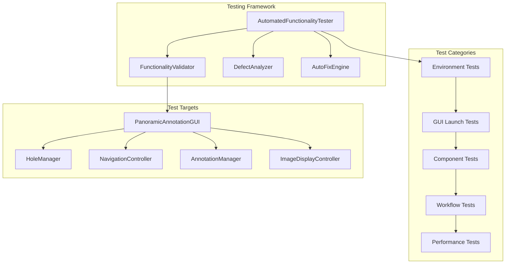
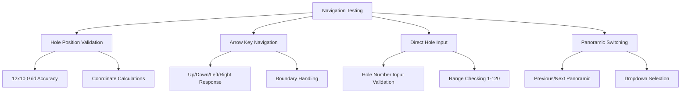
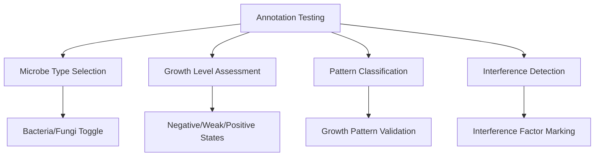
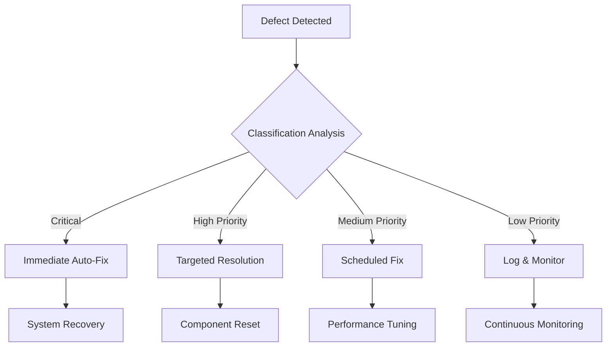

# Automated GUI Functionality Testing Framework

## Overview

This document outlines a refactored automated testing framework specifically designed for functionality detection in the panoramic annotation GUI tool. The system leverages the existing runtime environment and panoramic image library at `D:\test\images` to provide comprehensive functionality validation with intelligent defect detection and auto-resolution capabilities.

## Technology Stack & Dependencies

### Core Testing Technologies
- **Python**: 3.8+ with existing virtual environment at `batch_annotation_tool\venv`
- **GUI Framework**: tkinter with enhanced automated interaction capabilities
- **Test Engine**: Enhanced automated testing with continuous validation
- **Image Processing**: PIL/Pillow for test image validation

### Testing Architecture


## Functionality Testing Components

### Core Functionality Detection Matrix

#### Navigation System Functionality


#### Annotation System Functionality  


### Automated Test Execution Framework

#### Comprehensive Functionality Tester Class
```python
class AutomatedFunctionalityTester:
    def __init__(self, test_image_dir="D:\\test\\images"):
        self.test_image_dir = test_image_dir
        self.functionality_results = {}
        self.defects_detected = []
        self.auto_fixes_applied = []
        self.test_session_id = f"func_test_{int(time.time())}"
    
    def execute_comprehensive_functionality_test(self):
        """Execute complete functionality validation suite"""
        
        test_phases = [
            self.test_environment_functionality,
            self.test_gui_startup_functionality,
            self.test_image_loading_functionality,
            self.test_navigation_functionality,
            self.test_annotation_functionality,
            self.test_data_persistence_functionality,
            self.test_performance_functionality
        ]
        
        for phase in test_phases:
            phase_result = self.execute_with_auto_fix(phase)
            self.functionality_results[phase.__name__] = phase_result
        
        return self.generate_functionality_report()
```

## Environment & Startup Functionality Testing

### Test Case EF-001: Virtual Environment Validation
- **Objective**: Validate virtual environment functionality and dependency availability
- **Test Steps**:
  1. Verify `venv` directory structure and activation capability
  2. Test Python executable functionality within venv
  3. Validate critical package imports (tkinter, PIL, pathlib)
  4. Test GUI module import capabilities
- **Auto-Fix Capabilities**:
  - Recreate corrupted virtual environment
  - Install missing dependencies via pip
  - Repair Python path configurations
- **Expected**: Fully functional Python environment ready for GUI execution

### Test Case EF-002: GUI Launch Functionality Detection
- **Objective**: Comprehensive GUI startup functionality validation
- **Test Steps**:
  1. Test multiple launch methods (`start_gui.py`, `launch_gui.py`, `panoramic_annotation_tool.py`)
  2. Validate main window creation and initialization
  3. Test GUI component loading and rendering
  4. Verify event system initialization
- **Functionality Validation Points**:
  - Window creation within timeout (15 seconds)
  - Menu bar and toolbar rendering
  - Canvas initialization
  - Panel layout completion
- **Auto-Fix Strategies**:
  - GUI component reset and reinitialization
  - Memory cleanup and resource reallocation
  - Alternative launch method switching
- **Expected**: Reliable GUI startup with all components functional

## Image System Functionality Testing

### Test Case IF-001: Directory Configuration Functionality
- **Objective**: Test directory management and configuration capabilities
- **Test Data Source**: `D:\test\images` with panoramic image library
- **Functionality Tests**:
  1. Directory path validation and accessibility
  2. Panoramic image detection and enumeration
  3. Subdirectory structure recognition
  4. File format support validation
- **Auto-Validation Points**:
  - Directory permissions and access rights
  - Image file format compatibility
  - Metadata extraction capability
  - File system error handling
- **Auto-Fix Capabilities**:
  - Directory permission correction
  - Test image generation if missing
  - Format conversion for unsupported files
- **Expected**: Robust directory management with comprehensive image support

### Test Case IF-002: Image Loading Performance Validation
- **Objective**: Validate image loading functionality and performance
- **Test Execution**:
  1. Load panoramic images from test library
  2. Measure loading performance and memory usage
  3. Test image display and rendering quality
  4. Validate slice image organization and access
- **Performance Benchmarks**:
  - Image loading time < 3 seconds per panoramic
  - Memory usage < 2GB for typical datasets
  - Display rendering < 500ms
- **Functionality Validation**:
  - Image scaling and aspect ratio preservation
  - Canvas rendering accuracy
  - Slice image mapping correctness
- **Expected**: Efficient image handling with optimal performance

## Navigation Functionality Testing

### Test Case NF-001: Hole Navigation System Validation  
- **Objective**: Comprehensive validation of hole positioning and navigation
- **Navigation Tests**:
  1. **Grid Layout Validation**: Test 12×10 hole grid accuracy
  2. **Coordinate Calculations**: Verify hole center positioning
  3. **Arrow Navigation**: Test directional movement (↑↓←→)
  4. **Direct Navigation**: Test hole number input (1-120)
  5. **Boundary Handling**: Test edge cases and limits
- **Auto-Validation Criteria**:
  - Hole positioning accuracy within 5 pixels
  - Navigation response time < 200ms
  - Boundary condition handling
  - State consistency across navigation
- **Auto-Fix Capabilities**:
  - Automatic hole parameter recalibration
  - Navigation algorithm optimization
  - Boundary condition correction
- **Expected**: Precise, responsive navigation system

### Test Case NF-002: Panoramic Navigation Functionality
- **Objective**: Test multi-panoramic navigation capabilities
- **Test Scenarios**:
  1. Previous/Next panoramic image switching
  2. Panoramic dropdown selection functionality
  3. State preservation during panoramic transitions
  4. Image loading consistency across panoramics
- **Functionality Validation**:
  - Smooth transitions between panoramic images
  - Consistent hole positioning across images
  - Annotation state preservation
  - Performance consistency
- **Expected**: Seamless multi-panoramic navigation workflow

## Annotation Functionality Testing

### Test Case AF-001: Core Annotation Feature Validation
- **Objective**: Validate all annotation functionality components
- **Feature Testing Matrix**:

| Feature | Test Method | Validation Criteria |
|---------|-------------|-------------------|
| Microbe Type Selection | Bacteria/Fungi toggle | State persistence, UI update |
| Growth Level Assessment | Negative/Weak/Positive | Value storage, display update |
| Growth Pattern Classification | Pattern dropdown selection | Label generation, data integrity |
| Interference Factor Marking | Multi-select capability | Combined labeling, data structure |
| Confidence Rating | Slider interaction | Value range 0.0-1.0, precision |

- **Auto-Validation Process**:
  1. Systematically test each annotation component
  2. Validate data storage and retrieval
  3. Test UI responsiveness and feedback
  4. Verify data export integrity
- **Expected**: Fully functional annotation system with comprehensive feature coverage

### Test Case AF-002: Enhanced Annotation Workflow Validation
- **Objective**: Test advanced annotation capabilities and workflows
- **Workflow Tests**:
  1. **Multi-Feature Annotation**: Test combining multiple annotation types
  2. **Batch Operations**: Test bulk annotation capabilities
  3. **Annotation Modification**: Test editing and updating existing annotations
  4. **Quality Assurance**: Test annotation review and validation features
- **Integration Validation**:
  - Cross-component data consistency
  - Workflow state management
  - Performance under annotation load
- **Expected**: Robust annotation workflow supporting complex use cases

## Data Persistence Functionality Testing

### Test Case DF-001: Annotation Save/Load Functionality
- **Objective**: Comprehensive validation of data persistence capabilities
- **Persistence Tests**:
  1. **Manual Save Operations**: Test custom filename save functionality
  2. **Auto-Save Behavior**: Validate automatic save triggers and timing
  3. **Load Operations**: Test annotation file loading and state restoration
  4. **Data Integrity**: Verify complete annotation data preservation
- **Data Validation Points**:
  - Complete annotation state restoration
  - File format integrity
  - Cross-session data consistency
  - Error handling for corrupted files
- **Expected**: Reliable data persistence with comprehensive state management

### Test Case DF-002: Export Functionality Validation
- **Objective**: Test data export capabilities and format compliance
- **Export Tests**:
  1. JSON format export with complete annotation data
  2. CSV format export for analysis tools
  3. Custom format export for ML training pipelines
  4. Batch export operations for multiple datasets
- **Quality Validation**:
  - Export data completeness and accuracy
  - Format specification compliance
  - Performance with large datasets
- **Expected**: Robust export system supporting multiple formats and use cases

## Performance & Stress Testing

### Test Case PF-001: System Performance Validation
- **Objective**: Validate system performance under various load conditions
- **Performance Benchmarks**:

| Metric | Target | Validation Method |
|--------|--------|------------------|
| Startup Time | < 15 seconds | Automated timing measurement |
| Navigation Response | < 200ms | UI interaction timing |
| Image Loading | < 3 seconds | Load time measurement |
| Annotation Save | < 1 second | File operation timing |
| Memory Usage | < 2GB | Resource monitoring |

- **Stress Testing Scenarios**:
  1. Large dataset loading (50+ panoramic images)
  2. Rapid navigation stress testing (100+ hole transitions/minute)
  3. Intensive annotation operations (continuous annotation for 30 minutes)
  4. Extended session testing (4+ hours operation)
- **Auto-Optimization Triggers**:
  - Performance degradation detection
  - Memory leak identification
  - Resource exhaustion warnings
- **Expected**: Consistent performance meeting or exceeding benchmarks

## Automated Defect Detection & Resolution

### Intelligent Defect Classification System


### Auto-Fix Strategy Implementation
```python
class AutomatedFixEngine:
    def __init__(self):
        self.fix_strategies = {
            "gui_freeze": self.fix_gui_responsiveness,
            "navigation_error": self.fix_navigation_system,
            "annotation_failure": self.fix_annotation_components,
            "image_loading_error": self.fix_image_system,
            "performance_degradation": self.optimize_performance
        }
    
    def apply_intelligent_fix(self, defect):
        """Apply appropriate fix based on defect analysis"""
        fix_strategy = self.identify_fix_strategy(defect)
        return fix_strategy(defect)
    
    def fix_gui_responsiveness(self, defect):
        """Fix GUI freezing and responsiveness issues"""
        # Implementation for GUI responsiveness fixes
        pass
```

## Expected Test Results & Success Criteria

### Functionality Validation Matrix
- **Environment Setup**: 100% automated validation with self-healing
- **GUI Launch**: Multi-method validation with fallback strategies
- **Image System**: Robust handling of test image library
- **Navigation**: Precision validation with performance benchmarks
- **Annotation**: Comprehensive feature testing with data integrity
- **Persistence**: Complete save/load validation with error recovery
- **Performance**: Benchmark compliance with auto-optimization

### Continuous Testing Cycle
- **Test Execution**: Fully automated with minimal manual intervention
- **Defect Resolution**: Intelligent auto-fix with success tracking
- **Performance Monitoring**: Real-time metrics with optimization triggers
- **Quality Assurance**: Comprehensive validation with audit trail