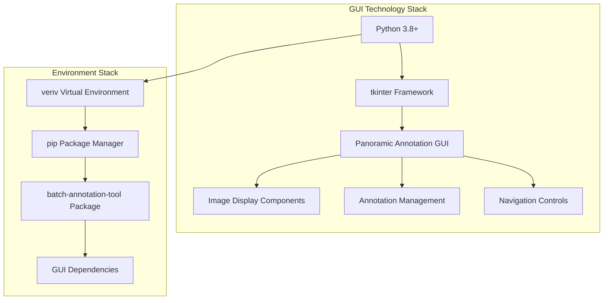
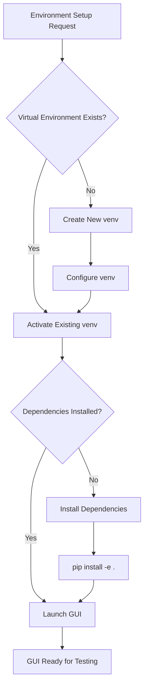
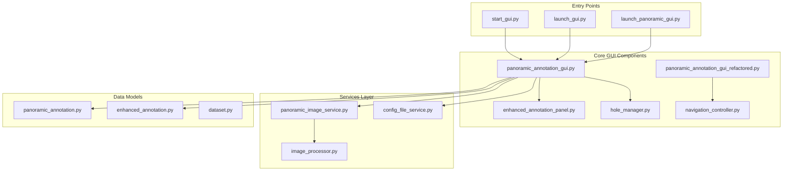
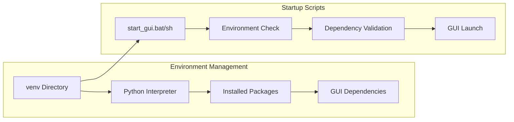
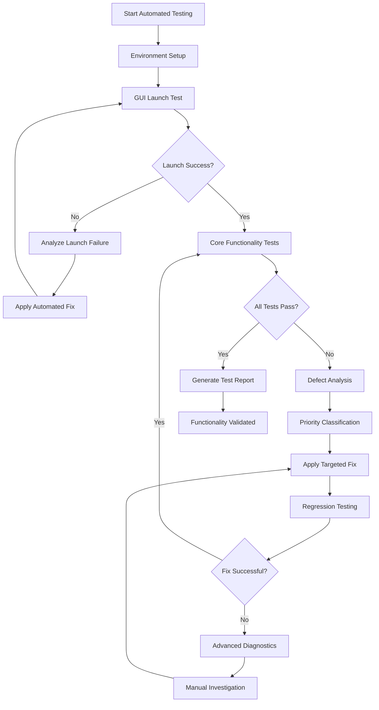
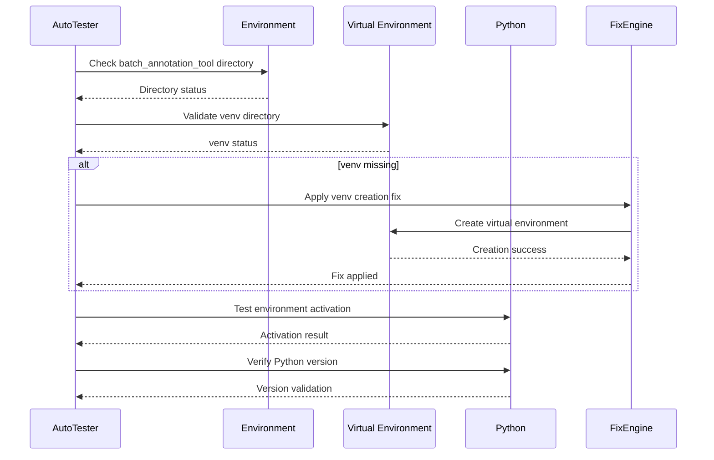
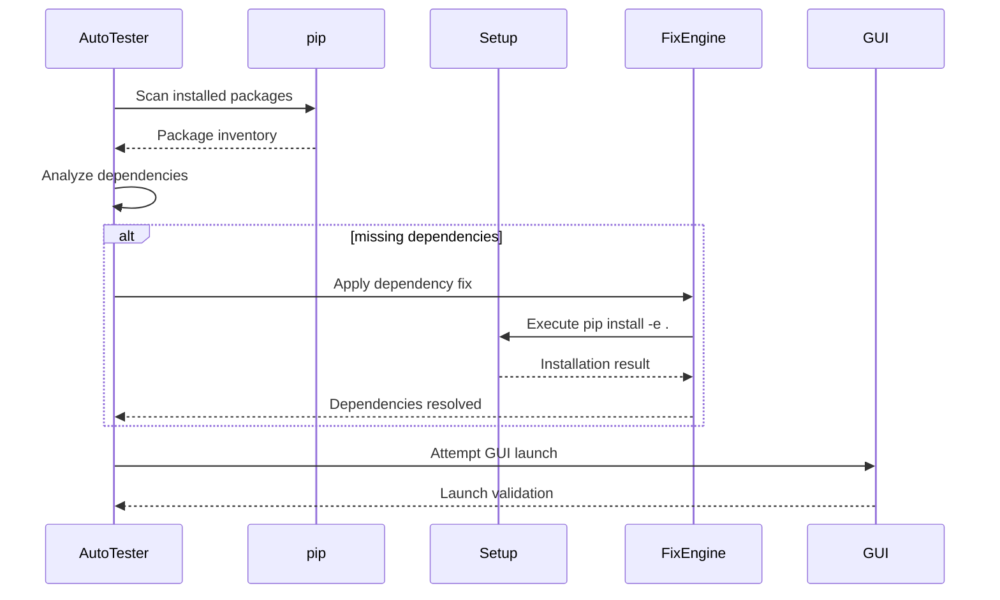
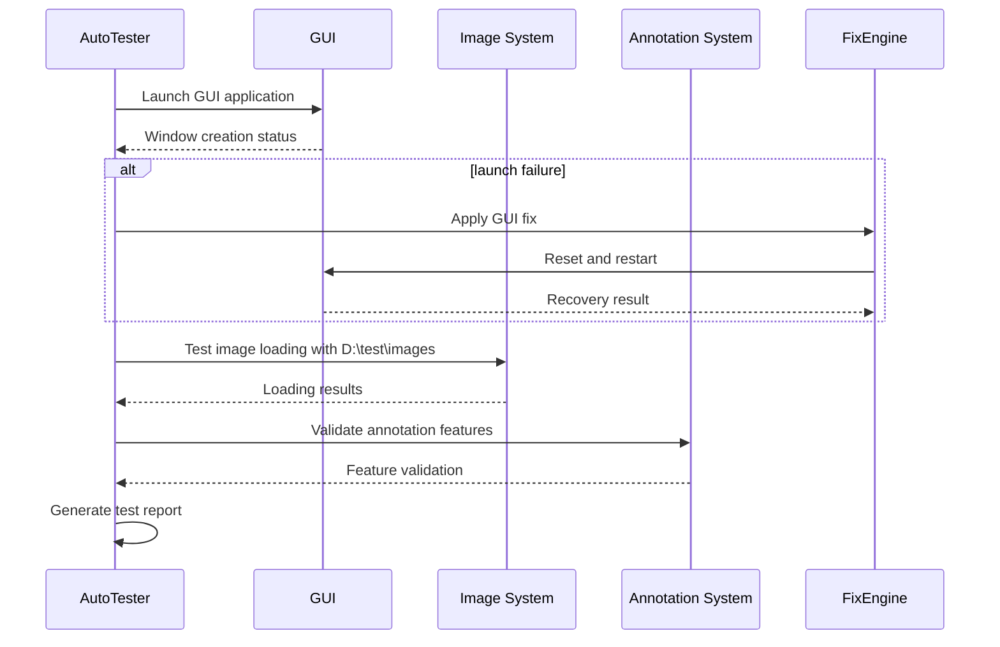
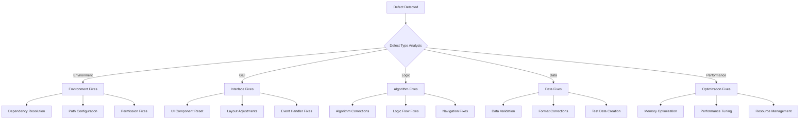

# Test GUI Environment Setup Design

## Overview

This design document outlines the environment setup and preparation procedures for testing the Panoramic Image Annotation Tool's graphical user interface (GUI). The system utilizes a pre-configured Python virtual environment (`venv`) located in the `batch_annotation_tool` directory and provides multiple GUI launch mechanisms through `start_gui.py` and related startup scripts.

## Technology Stack & Dependencies

### Core Technologies
- **Python**: 3.8+ (Primary runtime environment)
- **GUI Framework**: tkinter (Built-in Python GUI toolkit)
- **Virtual Environment**: venv (Python built-in virtual environment)
- **Package Management**: pip with setup.py configuration

### GUI Components Stack


### Key Dependencies
- **PIL/Pillow**: Image processing and display
- **PyYAML**: Configuration file management
- **click**: Command-line interface (for CLI components)
- **tkinter**: GUI framework (built-in with Python)

## Environment Architecture

### Directory Structure
```
batch_annotation_tool/
├── venv/                          # Pre-configured Python virtual environment
│   ├── Scripts/                   # Windows executables (activate.bat, python.exe)
│   ├── Lib/                       # Python packages and libraries
│   ├── Include/                   # Header files
│   └── pyvenv.cfg                 # Virtual environment configuration
├── src/                           # Source code directory
│   └── ui/                        # GUI components
│       ├── panoramic_annotation_gui.py
│       ├── panoramic_annotation_gui_refactored.py
│       └── [other GUI modules]
├── start_gui.py                   # Primary GUI launcher
├── start_gui.bat                  # Windows startup script
├── start_gui.sh                   # Linux/macOS startup script
├── launch_gui.py                  # Alternative GUI launcher
├── launch_panoramic_gui.py        # Panoramic-specific launcher
└── setup.py                      # Package configuration
```

### Environment Preparation Flow


## GUI Launch Methods

### Primary Launch Options

#### 1. Direct Python Execution
```bash
# Activate environment manually
cd d:\dev\annotation_tools\batch_annotation_tool
venv\Scripts\activate  # Windows
# source venv/bin/activate  # Linux/macOS

# Launch GUI
python start_gui.py
```

#### 2. Automated Batch Script (Windows)
```batch
# Automated environment setup and launch
start_gui.bat
```

#### 3. Automated Shell Script (Linux/macOS)
```bash
# Automated environment setup and launch
./start_gui.sh
```

#### 4. Alternative Launchers
```bash
# Enhanced launcher with error checking
python launch_gui.py

# Panoramic-specific launcher
python launch_panoramic_gui.py
```

### Launch Method Comparison

| Method | Platform | Auto Environment | Error Handling | Recommended For |
|--------|----------|------------------|----------------|-----------------|
| `start_gui.py` | Cross-platform | Manual | Basic | Development/Testing |
| `start_gui.bat` | Windows | Automatic | Advanced | Windows Users |
| `start_gui.sh` | Linux/macOS | Automatic | Advanced | Unix Users |
| `launch_gui.py` | Cross-platform | Manual | Enhanced | Advanced Testing |

## Component Architecture

### GUI System Architecture


### Environment Setup Components


## Automated Testing Strategy

### Continuous Testing Framework



### Automated Test Execution Engine

#### Test Runner Architecture
```python
class AutomatedTestRunner:
    def __init__(self, test_directory="D:\\test\\images"):
        self.test_directory = test_directory
        self.defects = []
        self.fixes_applied = []
        self.test_cycles = 0
        self.max_cycles = 10
    
    def run_continuous_testing(self):
        while self.test_cycles < self.max_cycles:
            cycle_results = self.execute_test_cycle()
            if cycle_results.all_passed:
                break
            self.analyze_and_fix_defects(cycle_results)
            self.test_cycles += 1
            
    def execute_test_cycle(self):
        """Execute complete automated test suite"""
        results = TestResults()
        
        # Phase 1: Environment validation
        results.environment = self.test_environment_setup()
        
        # Phase 2: GUI launch testing
        results.gui_launch = self.test_gui_launch()
        
        # Phase 3: Functionality testing
        results.functionality = self.test_core_functionality()
        
        return results
```

### Environment Testing Phases

#### Phase 1: Automated Environment Validation


#### Phase 2: Automated Dependency Testing


#### Phase 3: Automated GUI Functionality Testing


### Automated Test Execution Framework

#### Comprehensive Environment Test Suite
```python
# automated_environment_tester.py
import os
import sys
import subprocess
import time
import logging
from pathlib import Path

class AutomatedEnvironmentTester:
    def __init__(self, base_path="d:\\dev\\annotation_tools\\batch_annotation_tool"):
        self.base_path = Path(base_path)
        self.test_results = []
        self.fixes_applied = []
        self.logger = self._setup_logging()
    
    def run_comprehensive_test_suite(self):
        """Execute complete automated test suite with auto-healing"""
        self.logger.info("Starting comprehensive automated test suite")
        
        # Execute test phases with auto-fixing
        phases = [
            self.test_environment_validation,
            self.test_dependency_resolution,
            self.test_gui_launch_validation,
            self.test_image_loading_system,
            self.test_annotation_functionality,
            self.test_navigation_system,
            self.test_data_persistence
        ]
        
        for phase in phases:
            result = self.execute_phase_with_auto_fix(phase)
            self.test_results.append(result)
            if not result.success:
                self.logger.error(f"Phase {phase.__name__} failed after auto-fix attempts")
        
        return self.generate_final_report()
    
    def test_environment_validation(self):
        """Automated environment validation with auto-fixing"""
        result = TestResult("Environment Validation")
        
        try:
            # Test 1: Virtual environment validation
            venv_path = self.base_path / "venv"
            if not venv_path.exists():
                self.logger.warning("Virtual environment missing - auto-creating")
                self.apply_venv_creation_fix()
                result.fixes_applied.append("venv_creation")
            
            # Test 2: Python executable validation
            python_exe = venv_path / "Scripts" / "python.exe"
            if not python_exe.exists():
                self.logger.error("Python executable not found in venv")
                result.success = False
                return result
            
            # Test 3: Environment activation test
            activation_result = self.test_environment_activation()
            if not activation_result:
                self.apply_activation_fix()
                result.fixes_applied.append("activation_fix")
            
            # Test 4: Python version validation
            version_valid = self.validate_python_version()
            if not version_valid:
                self.logger.error("Python version incompatible")
                result.success = False
                return result
            
            result.success = True
            self.logger.info("Environment validation completed successfully")
            
        except Exception as e:
            self.logger.error(f"Environment validation failed: {e}")
            result.success = False
            result.error = str(e)
        
        return result
    
    def test_dependency_resolution(self):
        """Automated dependency testing with resolution"""
        result = TestResult("Dependency Resolution")
        
        try:
            # Check for required packages
            required_packages = [
                "tkinter", "PIL", "PyYAML", "click"
            ]
            
            missing_packages = self.scan_missing_packages(required_packages)
            if missing_packages:
                self.logger.info(f"Installing missing packages: {missing_packages}")
                self.apply_dependency_installation_fix(missing_packages)
                result.fixes_applied.append("dependency_installation")
            
            # Validate package imports
            import_test_result = self.test_package_imports()
            if not import_test_result.success:
                self.apply_import_resolution_fix()
                result.fixes_applied.append("import_resolution")
            
            # Test GUI module imports specifically
            gui_import_result = self.test_gui_module_imports()
            if not gui_import_result:
                self.apply_gui_import_fix()
                result.fixes_applied.append("gui_import_fix")
            
            result.success = True
            self.logger.info("Dependency resolution completed successfully")
            
        except Exception as e:
            self.logger.error(f"Dependency resolution failed: {e}")
            result.success = False
            result.error = str(e)
        
        return result
    
    def test_gui_launch_validation(self):
        """Automated GUI launch testing with recovery"""
        result = TestResult("GUI Launch Validation")
        
        try:
            # Test multiple launch methods
            launch_methods = [
                ("start_gui.py", self.test_direct_launch),
                ("start_gui.bat", self.test_batch_launch),
                ("launch_gui.py", self.test_enhanced_launch)
            ]
            
            successful_launches = 0
            for method_name, launch_func in launch_methods:
                self.logger.info(f"Testing launch method: {method_name}")
                launch_result = launch_func()
                
                if launch_result.success:
                    successful_launches += 1
                else:
                    self.logger.warning(f"Launch method {method_name} failed")
                    self.apply_launch_method_fix(method_name)
                    result.fixes_applied.append(f"launch_fix_{method_name}")
            
            # At least one launch method must succeed
            result.success = successful_launches > 0
            self.logger.info(f"GUI launch validation: {successful_launches}/{len(launch_methods)} methods successful")
            
        except Exception as e:
            self.logger.error(f"GUI launch validation failed: {e}")
            result.success = False
            result.error = str(e)
        
        return result
    
    def test_image_loading_system(self):
        """Automated image loading validation"""
        result = TestResult("Image Loading System")
        
        try:
            # Test with D:\test\images directory
            test_image_dir = Path("D:\\test\\images")
            
            if not test_image_dir.exists():
                self.logger.warning("Test image directory missing - creating sample data")
                self.create_test_image_structure()
                result.fixes_applied.append("test_data_creation")
            
            # Test panoramic image detection
            panoramic_images = self.scan_panoramic_images(test_image_dir)
            if not panoramic_images:
                self.logger.warning("No panoramic images found - generating test images")
                self.generate_test_images()
                result.fixes_applied.append("test_image_generation")
            
            # Test image loading performance
            loading_performance = self.test_image_loading_performance()
            if not loading_performance.within_limits:
                self.apply_performance_optimization()
                result.fixes_applied.append("performance_optimization")
            
            result.success = True
            self.logger.info("Image loading system validated successfully")
            
        except Exception as e:
            self.logger.error(f"Image loading system test failed: {e}")
            result.success = False
            result.error = str(e)
        
        return result
```

#### Automated Launch Method Testing
```python
def test_launch_methods_comprehensive(self):
    """Comprehensive launch method testing with auto-recovery"""
    
    launch_configurations = [
        {
            "name": "start_gui.py",
            "command": ["python", "start_gui.py"],
            "timeout": 30,
            "expected_window_title": "Panoramic Annotation"
        },
        {
            "name": "start_gui.bat",
            "command": ["start_gui.bat"],
            "timeout": 45,
            "expected_window_title": "Panoramic Annotation"
        },
        {
            "name": "launch_panoramic_gui.py",
            "command": ["python", "launch_panoramic_gui.py"],
            "timeout": 30,
            "expected_window_title": "Panoramic Annotation"
        }
    ]
    
    results = []
    for config in launch_configurations:
        result = self.test_single_launch_method(config)
        results.append(result)
        
        if not result.success:
            # Apply auto-fix for failed launch method
            fix_result = self.apply_launch_fix(config)
            if fix_result.success:
                # Retry after fix
                retry_result = self.test_single_launch_method(config)
                results[-1] = retry_result
    
    return results
```

## Defect Analysis & Automated Resolution Framework

### Automated Defect Classification System



### Intelligent Automated Fix Engine

#### Priority-Based Resolution System
```python
class AutomatedFixEngine:
    def __init__(self):
        self.fix_strategies = {
            "P0_CRITICAL": self.apply_critical_fixes,
            "P1_HIGH": self.apply_high_priority_fixes,
            "P2_MEDIUM": self.apply_medium_priority_fixes,
            "P3_LOW": self.apply_low_priority_fixes
        }
        self.fix_history = []
    
    def analyze_and_fix_defect(self, defect):
        """Analyze defect and apply appropriate automated fix"""
        
        # Classify defect priority
        priority = self.classify_defect_priority(defect)
        
        # Apply appropriate fix strategy
        fix_result = self.fix_strategies[priority](defect)
        
        # Log fix attempt
        self.fix_history.append({
            "defect": defect,
            "priority": priority,
            "fix_applied": fix_result,
            "timestamp": time.time()
        })
        
        return fix_result
    
    def apply_critical_fixes(self, defect):
        """Handle critical issues: crashes, startup failures"""
        if defect.type == "STARTUP_FAILURE":
            return self.fix_startup_issues(defect)
        elif defect.type == "ENVIRONMENT_MISSING":
            return self.fix_environment_issues(defect)
        elif defect.type == "CRITICAL_IMPORT_ERROR":
            return self.fix_import_issues(defect)
        return False
    
    def fix_startup_issues(self, defect):
        """Automated startup issue resolution"""
        fixes_applied = []
        
        # Fix 1: Recreate virtual environment
        if "venv" in defect.description.lower():
            result = self.recreate_virtual_environment()
            if result:
                fixes_applied.append("venv_recreation")
        
        # Fix 2: Reinstall dependencies
        if "import" in defect.description.lower():
            result = self.reinstall_dependencies()
            if result:
                fixes_applied.append("dependency_reinstall")
        
        # Fix 3: Reset configuration
        if "config" in defect.description.lower():
            result = self.reset_configuration()
            if result:
                fixes_applied.append("config_reset")
        
        return len(fixes_applied) > 0
    
    def fix_environment_issues(self, defect):
        """Automated environment issue resolution"""
        # Create missing directories
        required_dirs = ["venv", "src", "config"]
        for dir_name in required_dirs:
            if not os.path.exists(dir_name):
                if dir_name == "venv":
                    subprocess.run(["python", "-m", "venv", "venv"])
                else:
                    os.makedirs(dir_name, exist_ok=True)
        
        # Set up Python path
        src_path = os.path.join(os.getcwd(), "src")
        if src_path not in sys.path:
            sys.path.insert(0, src_path)
        
        return True
```

#### Automated Fix Strategies

##### Environment & Startup Fixes
```python
def apply_environment_fixes(self, defect):
    """Comprehensive environment fixing"""
    
    fix_actions = [
        self.ensure_virtual_environment_exists,
        self.validate_python_installation,
        self.install_missing_dependencies,
        self.configure_python_paths,
        self.set_proper_permissions,
        self.validate_startup_scripts
    ]
    
    successful_fixes = 0
    for fix_action in fix_actions:
        try:
            result = fix_action()
            if result:
                successful_fixes += 1
        except Exception as e:
            self.logger.warning(f"Fix action failed: {e}")
    
    return successful_fixes >= len(fix_actions) // 2  # At least half successful

def ensure_virtual_environment_exists(self):
    """Ensure virtual environment is properly configured"""
    venv_path = Path("venv")
    
    if not venv_path.exists():
        # Create new virtual environment
        result = subprocess.run(["python", "-m", "venv", "venv"], 
                              capture_output=True, text=True)
        if result.returncode != 0:
            return False
    
    # Verify activation script exists
    activate_script = venv_path / "Scripts" / "activate.bat"
    if not activate_script.exists():
        # Recreate if activation script missing
        shutil.rmtree(venv_path)
        result = subprocess.run(["python", "-m", "venv", "venv"])
        return result.returncode == 0
    
    return True

def install_missing_dependencies(self):
    """Automatically install missing dependencies"""
    try:
        # Activate virtual environment and install
        if os.name == 'nt':  # Windows
            activate_cmd = "venv\\Scripts\\activate && pip install -e ."
        else:  # Linux/Mac
            activate_cmd = "source venv/bin/activate && pip install -e ."
        
        result = subprocess.run(activate_cmd, shell=True, 
                              capture_output=True, text=True)
        return result.returncode == 0
    except Exception:
        return False
```

##### GUI & Interface Fixes
```python
def apply_gui_fixes(self, defect):
    """Automated GUI issue resolution"""
    
    if defect.category == "WIDGET_ERROR":
        return self.fix_widget_issues(defect)
    elif defect.category == "LAYOUT_ERROR":
        return self.fix_layout_issues(defect)
    elif defect.category == "EVENT_ERROR":
        return self.fix_event_handling_issues(defect)
    elif defect.category == "DISPLAY_ERROR":
        return self.fix_display_issues(defect)
    
    return False

def fix_widget_issues(self, defect):
    """Fix tkinter widget-related issues"""
    # Common widget fixes
    widget_fixes = [
        self.reset_tkinter_root,
        self.reinitialize_widgets,
        self.check_widget_dependencies,
        self.validate_widget_hierarchy
    ]
    
    for fix in widget_fixes:
        try:
            if fix():
                return True
        except Exception as e:
            continue
    
    return False

def reset_tkinter_root(self):
    """Reset tkinter root window"""
    try:
        import tkinter as tk
        # Destroy existing root if any
        for widget in tk._default_root.winfo_children() if tk._default_root else []:
            widget.destroy()
        
        # Create fresh root
        root = tk.Tk()
        root.withdraw()  # Hide until ready
        return True
    except Exception:
        return False
```

### Continuous Testing & Auto-Healing Cycle

```python
class ContinuousTestingEngine:
    def __init__(self, max_cycles=10):
        self.max_cycles = max_cycles
        self.current_cycle = 0
        self.defect_history = []
        self.fix_engine = AutomatedFixEngine()
    
    def run_until_functional(self):
        """Run continuous testing until all functionality is validated"""
        
        while self.current_cycle < self.max_cycles:
            self.current_cycle += 1
            
            # Execute comprehensive test suite
            test_results = self.execute_full_test_suite()
            
            if test_results.all_passed:
                self.logger.info(f"All tests passed in cycle {self.current_cycle}")
                return self.generate_success_report()
            
            # Analyze failures and apply fixes
            defects = self.analyze_test_failures(test_results)
            
            fixes_applied = 0
            for defect in defects:
                fix_result = self.fix_engine.analyze_and_fix_defect(defect)
                if fix_result:
                    fixes_applied += 1
            
            self.logger.info(f"Cycle {self.current_cycle}: {fixes_applied}/{len(defects)} defects fixed")
            
            # Short pause before next cycle
            time.sleep(5)
        
        # Max cycles reached
        return self.generate_final_report()
    
    def execute_full_test_suite(self):
        """Execute complete automated test suite"""
        test_suite = AutomatedTestSuite()
        
        results = TestResults()
        results.environment = test_suite.test_environment_setup()
        results.gui_launch = test_suite.test_gui_launch()
        results.image_loading = test_suite.test_image_loading()
        results.navigation = test_suite.test_navigation_system()
        results.annotation = test_suite.test_annotation_functionality()
        results.data_persistence = test_suite.test_data_persistence()
        
        return results
```

## Test Data Requirements & Automated Preparation

### Test Image Specifications
- **Primary Location**: `D:\test\images`
- **Backup Location**: `batch_annotation_tool/test_data`
- **Panoramic Format**: 3088×2064 resolution recommended
- **File Types**: JPEG, PNG, TIFF support validation
- **Slice Organization**: Automated subdirectory structure creation
- **Coverage**: Multiple panoramic images for comprehensive navigation testing

### Automated Test Data Setup
```python
class TestDataManager:
    def __init__(self, primary_path="D:\\test\\images"):
        self.primary_path = Path(primary_path)
        self.backup_path = Path("batch_annotation_tool/test_data")
        self.test_data_created = False
    
    def ensure_test_data_availability(self):
        """Ensure test data is available for automated testing"""
        
        # Check primary test data location
        if self.primary_path.exists() and self.has_valid_test_images():
            return True
        
        # Create test data if missing
        return self.create_comprehensive_test_dataset()
    
    def create_comprehensive_test_dataset(self):
        """Create comprehensive test dataset for all test scenarios"""
        
        # Create directory structure
        self.primary_path.mkdir(parents=True, exist_ok=True)
        
        # Generate test scenarios
        test_scenarios = [
            self.create_basic_panoramic_test_set,
            self.create_navigation_test_set,
            self.create_annotation_test_set,
            self.create_performance_test_set,
            self.create_edge_case_test_set
        ]
        
        for scenario_creator in test_scenarios:
            try:
                scenario_creator()
            except Exception as e:
                self.logger.warning(f"Test scenario creation failed: {e}")
        
        return self.validate_test_dataset()
    
    def create_basic_panoramic_test_set(self):
        """Create basic panoramic images for fundamental testing"""
        from PIL import Image, ImageDraw
        
        # Create sample panoramic images
        for i in range(5):
            # Create blank panoramic image
            img = Image.new('RGB', (3088, 2064), color='white')
            draw = ImageDraw.Draw(img)
            
            # Add grid pattern for hole positioning
            self.draw_hole_grid(draw, img.size)
            
            # Add test markers
            self.add_test_markers(draw, i)
            
            # Save panoramic image
            panoramic_file = self.primary_path / f"panoramic_{i:03d}.jpg"
            img.save(panoramic_file, "JPEG", quality=90)
            
            # Create corresponding slice directory
            slice_dir = self.primary_path / f"panoramic_{i:03d}_slices"
            slice_dir.mkdir(exist_ok=True)
            
            # Generate slice images
            self.create_slice_images(slice_dir, i)
    
    def create_slice_images(self, slice_dir, panoramic_id):
        """Create slice images for hole-specific testing"""
        from PIL import Image, ImageDraw
        
        # Create 120 slice images (12x10 grid)
        for hole_num in range(1, 121):
            # Create slice image
            slice_img = Image.new('RGB', (200, 200), color='lightgray')
            draw = ImageDraw.Draw(slice_img)
            
            # Add hole number
            draw.text((10, 10), f"Hole {hole_num}", fill='black')
            draw.text((10, 30), f"Pan {panoramic_id}", fill='black')
            
            # Add test pattern based on hole number
            self.add_hole_test_pattern(draw, hole_num)
            
            # Save slice image
            slice_file = slice_dir / f"hole_{hole_num:03d}.jpg"
            slice_img.save(slice_file, "JPEG", quality=85)
```

### Automated Validation Procedures

#### Comprehensive Test Execution Framework
```python
class AutomatedTestExecutor:
    def __init__(self):
        self.test_results = {}
        self.performance_metrics = {}
        self.defect_count = 0
        self.fix_success_count = 0
    
    def execute_comprehensive_validation(self):
        """Execute complete automated validation suite"""
        
        validation_phases = [
            ("Environment Setup", self.validate_environment_setup),
            ("GUI Launch", self.validate_gui_launch),
            ("Image Loading", self.validate_image_loading_system),
            ("Navigation System", self.validate_navigation_system),
            ("Annotation Features", self.validate_annotation_features),
            ("Data Persistence", self.validate_data_persistence),
            ("Performance Benchmarks", self.validate_performance_benchmarks),
            ("Edge Cases", self.validate_edge_cases),
            ("Integration Workflow", self.validate_integration_workflow)
        ]
        
        overall_success = True
        for phase_name, validator in validation_phases:
            self.logger.info(f"Executing validation phase: {phase_name}")
            
            phase_result = self.execute_validation_phase(validator)
            self.test_results[phase_name] = phase_result
            
            if not phase_result.success:
                overall_success = False
                self.logger.error(f"Validation phase {phase_name} failed")
            else:
                self.logger.info(f"Validation phase {phase_name} completed successfully")
        
        return self.generate_comprehensive_report(overall_success)
    
    def validate_environment_setup(self):
        """Comprehensive environment validation"""
        validation_result = ValidationResult("Environment Setup")
        
        # Test virtual environment
        venv_test = self.test_virtual_environment()
        validation_result.add_test("Virtual Environment", venv_test)
        
        # Test Python installation
        python_test = self.test_python_installation()
        validation_result.add_test("Python Installation", python_test)
        
        # Test dependency resolution
        dependency_test = self.test_dependency_resolution()
        validation_result.add_test("Dependency Resolution", dependency_test)
        
        # Test startup scripts
        startup_test = self.test_startup_scripts()
        validation_result.add_test("Startup Scripts", startup_test)
        
        return validation_result
    
    def validate_gui_launch(self):
        """Comprehensive GUI launch validation"""
        validation_result = ValidationResult("GUI Launch")
        
        # Test multiple launch methods
        launch_methods = [
            ("start_gui.py", self.test_start_gui_py),
            ("start_gui.bat", self.test_start_gui_bat),
            ("launch_gui.py", self.test_launch_gui_py),
            ("panoramic_annotation_tool.py", self.test_panoramic_tool)
        ]
        
        for method_name, test_func in launch_methods:
            method_result = test_func()
            validation_result.add_test(method_name, method_result)
        
        return validation_result
    
    def validate_image_loading_system(self):
        """Comprehensive image loading validation"""
        validation_result = ValidationResult("Image Loading System")
        
        # Test directory configuration
        dir_config_test = self.test_directory_configuration()
        validation_result.add_test("Directory Configuration", dir_config_test)
        
        # Test image detection
        image_detection_test = self.test_image_detection()
        validation_result.add_test("Image Detection", image_detection_test)
        
        # Test image loading performance
        loading_performance_test = self.test_image_loading_performance()
        validation_result.add_test("Loading Performance", loading_performance_test)
        
        # Test slice organization
        slice_organization_test = self.test_slice_organization()
        validation_result.add_test("Slice Organization", slice_organization_test)
        
        return validation_result
```

### Performance Benchmarking & Optimization

#### Automated Performance Testing
```python
class PerformanceBenchmarkSuite:
    def __init__(self):
        self.benchmarks = {
            "startup_time": {"target": 15.0, "unit": "seconds"},
            "image_loading_time": {"target": 3.0, "unit": "seconds"},
            "navigation_response": {"target": 0.2, "unit": "seconds"},
            "annotation_save_time": {"target": 1.0, "unit": "seconds"},
            "memory_usage": {"target": 2048, "unit": "MB"}
        }
        self.optimization_applied = []
    
    def run_performance_benchmarks(self):
        """Execute comprehensive performance benchmarking"""
        
        benchmark_results = {}
        
        for benchmark_name, target_spec in self.benchmarks.items():
            self.logger.info(f"Running benchmark: {benchmark_name}")
            
            # Execute benchmark
            result = self.execute_benchmark(benchmark_name)
            benchmark_results[benchmark_name] = result
            
            # Check if optimization needed
            if result.value > target_spec["target"]:
                self.logger.warning(f"Benchmark {benchmark_name} exceeded target")
                optimization_result = self.apply_performance_optimization(benchmark_name)
                
                if optimization_result:
                    # Re-run benchmark after optimization
                    optimized_result = self.execute_benchmark(benchmark_name)
                    benchmark_results[f"{benchmark_name}_optimized"] = optimized_result
                    self.optimization_applied.append(benchmark_name)
        
        return self.generate_performance_report(benchmark_results)
    
    def execute_benchmark(self, benchmark_name):
        """Execute specific performance benchmark"""
        
        if benchmark_name == "startup_time":
            return self.benchmark_startup_time()
        elif benchmark_name == "image_loading_time":
            return self.benchmark_image_loading()
        elif benchmark_name == "navigation_response":
            return self.benchmark_navigation_response()
        elif benchmark_name == "annotation_save_time":
            return self.benchmark_annotation_save()
        elif benchmark_name == "memory_usage":
            return self.benchmark_memory_usage()
        
        return BenchmarkResult(benchmark_name, 0.0, "unknown")
    
    def apply_performance_optimization(self, benchmark_name):
        """Apply targeted performance optimization"""
        
        optimization_strategies = {
            "startup_time": [
                self.optimize_import_loading,
                self.enable_lazy_initialization,
                self.cache_startup_operations
            ],
            "image_loading_time": [
                self.optimize_image_caching,
                self.enable_progressive_loading,
                self.implement_background_loading
            ],
            "navigation_response": [
                self.optimize_ui_updates,
                self.enable_navigation_caching,
                self.reduce_computation_overhead
            ],
            "memory_usage": [
                self.implement_memory_cleanup,
                self.optimize_data_structures,
                self.enable_garbage_collection
            ]
        }
        
        strategies = optimization_strategies.get(benchmark_name, [])
        successful_optimizations = 0
        
        for strategy in strategies:
            try:
                if strategy():
                    successful_optimizations += 1
            except Exception as e:
                self.logger.warning(f"Optimization strategy failed: {e}")
        
        return successful_optimizations > 0
```