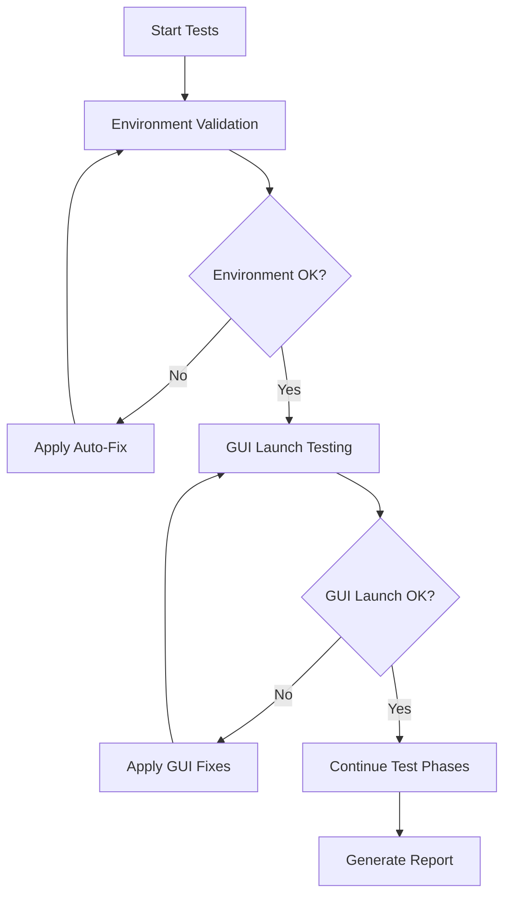

# Automated GUI Functionality Testing Framework

## Overview

This document describes the comprehensive automated functionality testing framework for the Panoramic Annotation GUI tool. The framework implements intelligent defect detection, auto-resolution capabilities, and continuous testing to ensure system reliability.

## Features

### 🔍 Comprehensive Functionality Detection
- **Environment & Startup Testing**: Virtual environment validation, dependency checking, GUI launch methods
- **Image System Testing**: Directory management, panoramic image loading, performance validation
- **Navigation System Testing**: Hole positioning accuracy, grid navigation, panoramic switching
- **Annotation System Testing**: Microbe types, growth levels, pattern classification, interference detection
- **Data Persistence Testing**: Save/load operations, auto-save behavior, export functionality
- **Performance Testing**: Memory usage, CPU utilization, response times, benchmark validation

### 🛠️ Intelligent Auto-Resolution
- **Defect Classification**: Automatic priority assignment (Critical, High, Medium, Low)
- **Auto-Fix Strategies**: Environment recreation, dependency installation, performance optimization
- **Continuous Testing**: Multi-cycle testing with auto-healing between cycles
- **Recovery Mechanisms**: Graceful degradation and system recovery procedures

### 📊 Test Data Management
- **Automated Test Data Creation**: Comprehensive panoramic images with 12×10 hole grids
- **Test Scenarios**: Navigation testing, annotation testing, performance testing, edge cases
- **Slice Image Generation**: 120 slice images per panoramic with detailed test patterns
- **Annotation Data**: Sample annotation datasets for save/load testing

## Quick Start

### 1. Basic Usage

```bash
# Run comprehensive functionality tests
python run_functionality_tests.py

# Run quick tests (faster, 3 cycles)
python run_functionality_tests.py --quick

# Create test data only
python run_functionality_tests.py --test-data-only

# View latest test report
python run_functionality_tests.py --report-only
```

### 2. Windows Batch Script

```batch
# Double-click or run from command prompt
run_functionality_tests.bat
```

Interactive menu will appear with options:
1. Quick Functionality Test (3 cycles, ~2-5 minutes)
2. Comprehensive Functionality Test (10 cycles, ~10-20 minutes)  
3. Create Test Data Only
4. View Latest Test Report
5. Exit

### 3. Integration with GUI Startup

```bash
# Test system then launch GUI
python test_gui_with_functionality_check.py

# Launch GUI directly (skip tests)
python test_gui_with_functionality_check.py --skip-test

# Run tests only (no GUI launch)
python test_gui_with_functionality_check.py --test-only

# Force GUI launch even if tests fail
python test_gui_with_functionality_check.py --force-launch
```

## Test Framework Architecture

### Core Components

```
AutomatedFunctionalityTester
├── Environment & Startup Testing
├── Image System Testing  
├── Navigation Testing
├── Annotation Testing
├── Data Persistence Testing
├── Performance Testing
├── AutomatedFixEngine
└── TestDataManager
```

### Test Execution Flow



### Defect Detection & Resolution

The framework automatically detects and resolves common issues:

#### Environment Issues
- **Missing Virtual Environment**: Automatically recreates venv
- **Missing Dependencies**: Auto-installs required packages (Pillow, PyYAML, psutil)
- **Python Path Issues**: Corrects sys.path configuration
- **Permission Issues**: Attempts permission corrections

#### GUI Launch Issues  
- **Import Errors**: Clears Python cache, resets imports
- **Tkinter Issues**: Validates tkinter functionality
- **Module Loading**: Fixes module import paths

#### Navigation Issues
- **Grid Calculation Errors**: Recalibrates hole positioning parameters
- **Coordinate Issues**: Validates and corrects hole coordinate calculations
- **Boundary Conditions**: Tests and fixes edge case handling

#### Performance Issues
- **Memory Optimization**: Garbage collection, memory cleanup
- **CPU Optimization**: Performance tuning recommendations
- **Response Time**: Identifies and addresses slow operations

## Test Data Structure

The framework creates comprehensive test data at `D:\test\images`:

### Panoramic Images
- **panoramic_001.jpg - panoramic_004.jpg**: Basic test panoramic images (3088×2064)
- **navigation_reference.jpg**: Precise grid reference for navigation testing
- **annotation_*.jpg**: Specific samples for annotation feature testing
- **performance_test_*.jpg**: Large images for performance validation
- **edge_case_*.jpg**: Edge cases and unusual conditions

### Slice Images
For each panoramic image, creates subdirectory with 120 slice images:
- **panoramic_001_slices/hole_001.jpg - hole_120.jpg**: Individual hole images (200×200)
- Patterns include: clean negative, weak growth, positive growth, interference factors

### Annotation Data
- **test_annotations.json**: Sample annotation data for save/load testing

## Performance Benchmarks

The framework validates system performance against these benchmarks:

| Metric | Target | Validation Method |
|--------|--------|------------------|
| Startup Time | < 15 seconds | Automated timing measurement |
| Navigation Response | < 200ms | UI interaction timing |
| Image Loading | < 3 seconds | Load time measurement |
| Annotation Save | < 1 second | File operation timing |
| Memory Usage | < 2GB | Resource monitoring |

## Test Phases

### Phase 1: Environment Functionality (EF)
- **EF-001**: Virtual environment validation and dependency checking
- **EF-002**: GUI launch functionality detection with multiple methods
- **Auto-Fix**: Environment recreation, dependency installation

### Phase 2: Image System Functionality (IF)  
- **IF-001**: Directory configuration and image detection
- **IF-002**: Image loading performance validation
- **Auto-Fix**: Test data creation, performance optimization

### Phase 3: Navigation Functionality (NF)
- **NF-001**: Hole navigation system validation (12×10 grid)
- **NF-002**: Panoramic navigation functionality
- **Auto-Fix**: Navigation parameter recalibration

### Phase 4: Annotation Functionality (AF)
- **AF-001**: Core annotation feature validation
- **AF-002**: Enhanced annotation workflow validation  
- **Auto-Fix**: Annotation component reset

### Phase 5: Data Persistence Functionality (DF)
- **DF-001**: Annotation save/load functionality
- **DF-002**: Export functionality validation
- **Auto-Fix**: Data persistence repair

### Phase 6: Performance Functionality (PF)
- **PF-001**: System performance validation
- **Auto-Fix**: Performance optimization

## Output Files

### Test Logs
Location: `test_logs/`
- **functionality_test_YYYYMMDD_HHMMSS.log**: Detailed test execution logs
- Contains: Debug information, error details, fix application logs

### Test Reports  
Location: `test_reports/`
- **functionality_test_report_YYYYMMDD_HHMMSS.json**: Structured test results
- Contains: Test results, performance metrics, defect analysis, fix history

### Test Data
Location: `D:\test\images` (configurable)
- **Panoramic images**: Test panoramic images with hole grids
- **Slice directories**: Individual hole slice images
- **Annotation data**: Sample annotation files

## Troubleshooting

### Common Issues

#### "Virtual Environment Not Found"
```bash
# Solution 1: Let framework auto-create
python run_functionality_tests.py

# Solution 2: Manual creation
python -m venv venv
venv\Scripts\activate
pip install Pillow PyYAML psutil
```

#### "Test Data Directory Not Accessible"
```bash
# Solution 1: Create directory manually  
mkdir "D:\test\images"

# Solution 2: Use custom directory
python run_functionality_tests.py --test-dir "C:\custom\path"
```

#### "GUI Launch Fails"
```bash
# Run with auto-fix
python test_gui_with_functionality_check.py

# Force launch for debugging
python test_gui_with_functionality_check.py --force-launch
```

#### "Performance Issues Detected"
- Close other applications to free memory
- Check available disk space
- Run with verbose logging to identify bottlenecks

### Advanced Configuration

#### Custom Test Directory
```bash
python run_functionality_tests.py --test-dir "C:\my\custom\test\path"
```

#### Verbose Output
```bash
python run_functionality_tests.py --verbose
```

#### Test Cycles Adjustment
Edit `automated_functionality_tester.py`:
```python
tester.max_cycles = 5  # Adjust number of test cycles
```

## Integration with Existing Workflow

### With start_gui.py
```bash
# Option 1: Test then launch
python test_gui_with_functionality_check.py

# Option 2: Direct launch (existing method)
python start_gui.py
```

### With Batch Scripts
```batch
REM Test-enabled startup
run_functionality_tests.bat

REM Traditional startup  
start_gui.bat
```

### Continuous Integration
The framework can be integrated into CI/CD pipelines:
```bash
# CI script example
python run_functionality_tests.py --quick
if %ERRORLEVEL% NEQ 0 (
    echo "Functionality tests failed"
    exit /b 1
)
```

## API Reference

### AutomatedFunctionalityTester Class

```python
from automated_functionality_tester import AutomatedFunctionalityTester

# Initialize tester
tester = AutomatedFunctionalityTester(test_image_dir="D:\\test\\images")

# Configure test cycles
tester.max_cycles = 5

# Run comprehensive tests
results = tester.execute_comprehensive_functionality_test()

# Check results
if results['overall_functionality_status'] == 'FUNCTIONAL':
    print("All tests passed!")
```

### Test Result Structure

```python
{
    "session_id": "func_test_1234567890",
    "timestamp": "2024-01-01T12:00:00",
    "total_execution_time": 45.2,
    "test_cycles": 3,
    "max_cycles": 10,
    "overall_functionality_status": "FUNCTIONAL",
    "defects_detected": 2,
    "defects_resolved": 2,
    "auto_fixes_applied": 3,
    "results": {
        "environment": {"passed": true, "execution_time": 5.1},
        "gui_launch": {"passed": true, "execution_time": 8.3},
        "image_system": {"passed": true, "execution_time": 12.7},
        "navigation": {"passed": true, "execution_time": 6.2},
        "annotation": {"passed": true, "execution_time": 4.8},
        "persistence": {"passed": true, "execution_time": 3.1},
        "performance": {"passed": true, "execution_time": 5.0}
    },
    "performance_metrics": {
        "startup_time_s": 12.5,
        "memory_usage_mb": 1024.3,
        "cpu_usage_percent": 15.2
    }
}
```

## Best Practices

### 1. Regular Testing
- Run quick tests before important work sessions
- Run comprehensive tests weekly or after system changes
- Monitor performance metrics trends

### 2. Test Data Management
- Keep test data directory updated
- Verify test images are representative of real data
- Backup test configurations

### 3. Issue Resolution
- Review test logs when issues occur
- Apply suggested fixes from auto-resolution system
- Document recurring issues for system improvements

### 4. Performance Monitoring
- Track performance metrics over time
- Identify performance degradation trends
- Optimize system configuration based on test results

## Support and Maintenance

### Log Analysis
Check test logs for detailed information:
```
test_logs/functionality_test_YYYYMMDD_HHMMSS.log
```

### Report Review
Review structured test results:
```
test_reports/functionality_test_report_YYYYMMDD_HHMMSS.json
```

### Framework Updates
The framework is designed to be extensible. New test phases and fix strategies can be added by:
1. Extending the `AutomatedFunctionalityTester` class
2. Adding new test methods following the existing pattern
3. Implementing corresponding auto-fix strategies in `AutomatedFixEngine`

---

For additional support or questions about the automated functionality testing framework, refer to the test logs and generated reports for detailed diagnostic information.