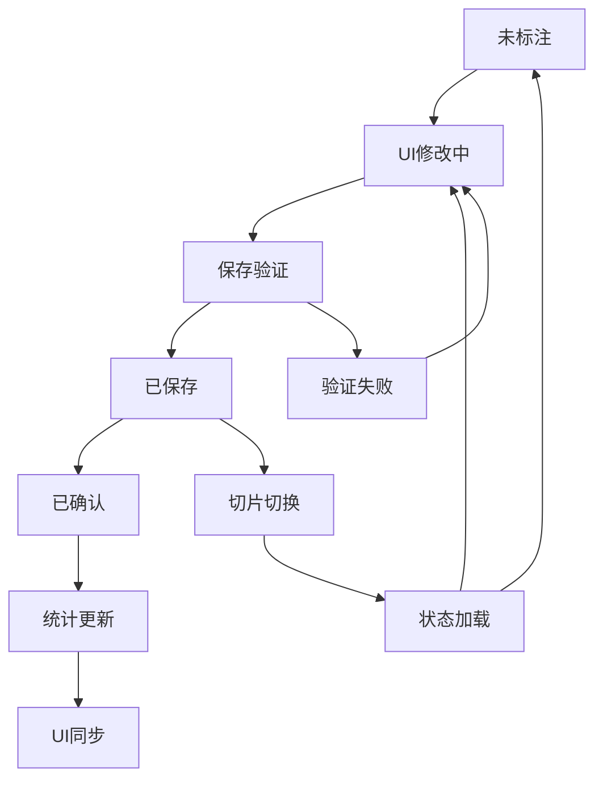
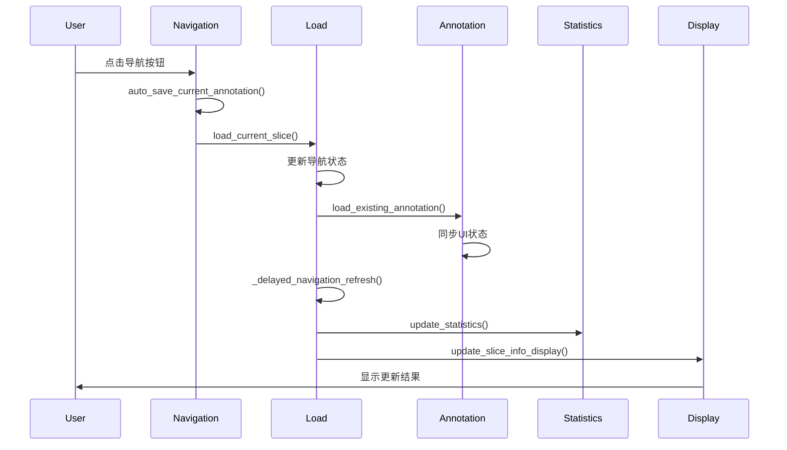

# 标注保存结构与状态生命周期分析

## 概述 (Executive Summary)

本文档对全景标注工具的标注保存结构、状态管理和统计数据进行全面的生命周期分析，识别当前架构的设计问题并提出改进建议。

## 1. 标注对象生命周期分析

### 1.1 标注对象层次结构

```
Annotation (Base Class)
    └── PanoramicAnnotation
        └── EnhancedPanoramicAnnotation
```

#### 基础层 - Annotation
- **职责**: 提供基础标注功能（image_path, label, bbox, confidence）
- **生命周期**: 创建 → 验证 → 序列化
- **状态**: 静态数据容器

#### 业务层 - PanoramicAnnotation  
- **职责**: 全景图相关属性（panoramic_id, hole_number, growth_level等）
- **生命周期**: 创建 → 验证 → 关联全景图 → 存储
- **状态字段**:
  ```python
  annotation_source: str = "manual"  # 标注来源
  is_confirmed: bool = False         # 确认状态
  growth_level: str = "negative"     # 生长级别
  interference_factors: List[str]    # 干扰因素
  ```

#### 增强层 - EnhancedPanoramicAnnotation
- **职责**: 复合特征标注（FeatureCombination）
- **生命周期**: 创建 → 特征组合 → 训练标签生成 → 兼容性处理
- **复杂性**: 双重数据结构（增强 + 兼容）

### 1.2 状态转换图



## 2. 状态管理架构分析

### 2.1 核心状态变量

#### 导航状态
```python
current_slice_index: int           # 当前切片索引 (0-based)
current_panoramic_id: str          # 当前全景图ID
current_hole_number: int           # 当前孔位号 (1-120)
slice_files: List[Dict]            # 切片文件列表
```

#### 标注状态
```python
current_dataset: PanoramicDataset  # 当前数据集
current_annotation_modified: bool  # 修改标记
last_annotation_time: Dict         # 时间戳缓存
auto_save_enabled: BooleanVar       # 自动保存开关
```

#### UI状态
```python
current_microbe_type: StringVar     # 微生物类型
current_growth_level: StringVar     # 生长级别
interference_factors: Dict[str, BooleanVar]  # 干扰因素
```

### 2.2 状态一致性问题

#### 问题1: 多重状态源
- **UI状态**: enhanced_annotation_panel
- **内存状态**: current_dataset.annotations
- **缓存状态**: last_annotation_time
- **显示状态**: slice_info_label, stats_label

#### 问题2: 状态同步时机
```python
# 不一致的状态更新顺序
def save_annotation():
    save_to_dataset()        # 1. 数据层更新
    update_ui_display()      # 2. UI层更新 (可能延迟)
    update_statistics()      # 3. 统计更新 (可能遗漏)
```

## 3. 数据流分析

### 3.1 保存数据流

```
用户输入 → Enhanced Panel → Feature Combination → Enhanced Annotation → Panoramic Annotation → Dataset → Statistics Update → UI Refresh
```

#### 数据转换链
1. **UI → FeatureCombination**
   ```python
   feature_combination = enhanced_annotation_panel.get_current_feature_combination()
   ```

2. **FeatureCombination → EnhancedPanoramicAnnotation**
   ```python
   enhanced_annotation = EnhancedPanoramicAnnotation(
       feature_combination=feature_combination,
       annotation_source="enhanced_manual"
   )
   ```

3. **Enhanced → Standard Annotation**
   ```python
   annotation = PanoramicAnnotation.from_filename(
       growth_level=feature_combination.growth_level.value,
       annotation_source="enhanced_manual"
   )
   annotation.enhanced_data = enhanced_annotation.to_dict()
   ```

4. **Dataset Storage**
   ```python
   dataset.add_annotation(annotation)
   ```

### 3.2 加载数据流

```
Dataset → Annotation Lookup → Enhanced Data Restoration → UI Synchronization → Display Update
```

#### 数据恢复链
1. **Dataset → Annotation**
   ```python
   existing_ann = dataset.get_annotation_by_hole(panoramic_id, hole_number)
   ```

2. **Enhanced Data Extraction**
   ```python
   if existing_ann.enhanced_data and existing_ann.annotation_source == 'enhanced_manual':
       feature_combination = FeatureCombination.from_dict(enhanced_data)
   ```

3. **UI Restoration**
   ```python
   enhanced_annotation_panel.set_feature_combination(feature_combination)
   ```

## 4. 统计系统分析

### 4.1 统计数据结构

```python
stats = {
    'negative': 0,
    'weak_growth': 0, 
    'positive': 0,
    'total': len(slice_files),
    'enhanced_annotated': 0,  # 增强标注数量
    'config_only': 0          # 配置导入数量
}
```

### 4.2 统计计算逻辑

#### 标注分类逻辑
```python
def classify_annotation(annotation):
    # 1. 检查是否为增强标注
    has_enhanced = (
        hasattr(annotation, 'enhanced_data') and 
        annotation.enhanced_data and 
        annotation.annotation_source == 'enhanced_manual'
    ) or (
        annotation.annotation_source == 'enhanced_manual'
    )
    
    # 2. 分类计数
    if has_enhanced:
        return 'enhanced'
    else:
        return 'config_import'
```

### 4.3 统计更新触发点

#### 当前触发点
- [x] `save_current_annotation_internal()`
- [x] `load_current_slice()` (通过延迟刷新)
- [x] `batch_annotate_holes()`
- [x] `clear_current_annotation()`
- [x] `load_annotations()`

#### 缺失的触发点
- [ ] 配置文件导入完成后
- [ ] 数据集加载完成后
- [ ] 批量操作撤销后

## 5. 切片切换生命周期

### 5.1 切换序列图



### 5.2 状态转换分析

#### 阶段1: 准备切换
```python
def go_next_hole():
    auto_save_current_annotation()  # 保存当前修改
    # 状态: current_annotation_modified -> False
```

#### 阶段2: 索引更新
```python
current_slice_index = new_index
current_panoramic_id = new_panoramic_id
current_hole_number = new_hole_number
```

#### 阶段3: 数据加载
```python
load_current_slice():
    load_existing_annotation()     # 恢复标注状态
    load_panoramic_image()         # 更新全景图
    load_slice_image()             # 更新切片图
```

#### 阶段4: 显示同步
```python
_delayed_navigation_refresh():
    update_statistics()            # 更新统计
    update_slice_info_display()    # 更新状态显示
    _verify_and_retry_sync()       # 验证同步
```

## 6. 问题识别与分析

### 6.1 架构问题

#### 问题1: 状态分散化
- **症状**: 状态散布在多个组件中
- **影响**: 同步困难，容易不一致
- **解决方案**: 集中状态管理

#### 问题2: 数据转换复杂性
- **症状**: Enhanced ↔ Standard 双向转换
- **影响**: 数据丢失风险，类型错误
- **解决方案**: 统一数据模型

#### 问题3: 异步更新时序
- **症状**: UI更新与数据更新不同步
- **影响**: 显示延迟，状态错误
- **解决方案**: 同步更新机制

### 6.2 性能问题

#### 问题1: 频繁的完整刷新
- **症状**: 每次切换都全量更新
- **影响**: 性能开销大
- **解决方案**: 增量更新

#### 问题2: 重复的统计计算
- **症状**: 多个地方重复计算统计
- **影响**: CPU浪费
- **解决方案**: 缓存机制

## 7. 设计改进建议

### 7.1 引入状态管理器

```python
class AnnotationStateManager:
    """集中式状态管理器"""
    
    def __init__(self):
        self.current_state = {
            'navigation': NavigationState(),
            'annotation': AnnotationState(),
            'statistics': StatisticsState(),
            'ui': UIState()
        }
        self.observers = []
    
    def update_state(self, key, value):
        old_value = self.current_state.get(key)
        self.current_state[key] = value
        self.notify_observers(key, old_value, value)
    
    def notify_observers(self, key, old_value, new_value):
        for observer in self.observers:
            observer.on_state_change(key, old_value, new_value)
```

### 7.2 统一数据模型

```python
class UnifiedAnnotation:
    """统一标注模型"""
    
    def __init__(self):
        self.basic_data = {}      # 基础数据
        self.enhanced_data = {}   # 增强数据
        self.meta_data = {}       # 元数据
    
    def get_compatible_view(self, format_type):
        """获取兼容视图"""
        if format_type == 'panoramic':
            return PanoramicAnnotation.from_unified(self)
        elif format_type == 'enhanced':
            return EnhancedPanoramicAnnotation.from_unified(self)
```

### 7.3 响应式更新机制

```python
class ReactiveUpdater:
    """响应式更新器"""
    
    def __init__(self):
        self.dependencies = {}
        self.update_queue = []
    
    def register_dependency(self, source, target, updater_func):
        if source not in self.dependencies:
            self.dependencies[source] = []
        self.dependencies[source].append((target, updater_func))
    
    def trigger_update(self, source):
        if source in self.dependencies:
            for target, updater_func in self.dependencies[source]:
                self.update_queue.append((target, updater_func))
        self.process_updates()
```

## 8. 实施建议

### 8.1 短期改进 (当前版本)
1. **强化同步检查点**: 在关键操作后添加验证
2. **优化刷新时序**: 使用更可靠的延迟刷新
3. **增加调试输出**: 便于问题追踪

### 8.2 中期重构 (下个版本)
1. **引入状态管理器**: 集中管理所有状态
2. **统一数据接口**: 减少类型转换
3. **实现增量更新**: 提高性能

### 8.3 长期优化 (未来版本)
1. **微服务架构**: 分离标注、统计、显示服务
2. **响应式编程**: 自动依赖追踪和更新
3. **性能监控**: 实时性能分析和优化

## 9. 结论

当前架构存在以下核心问题：

1. **状态管理分散**: 缺乏集中式状态管理，导致同步困难
2. **数据模型复杂**: 多层数据转换增加了出错概率
3. **更新时序不可靠**: 异步更新导致显示不一致

建议优先实施短期改进措施，逐步向集中式状态管理架构迁移，最终实现响应式的标注系统。这将显著提高系统的可靠性、性能和可维护性。