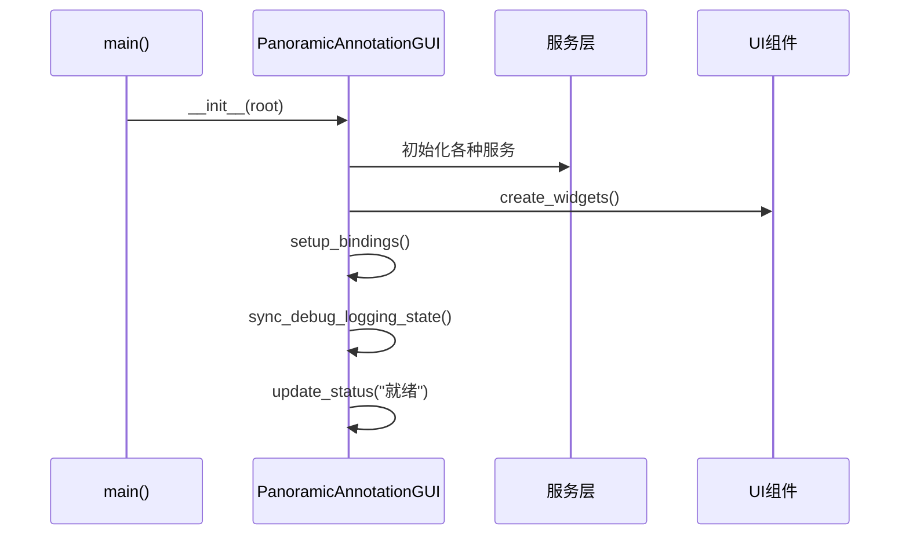
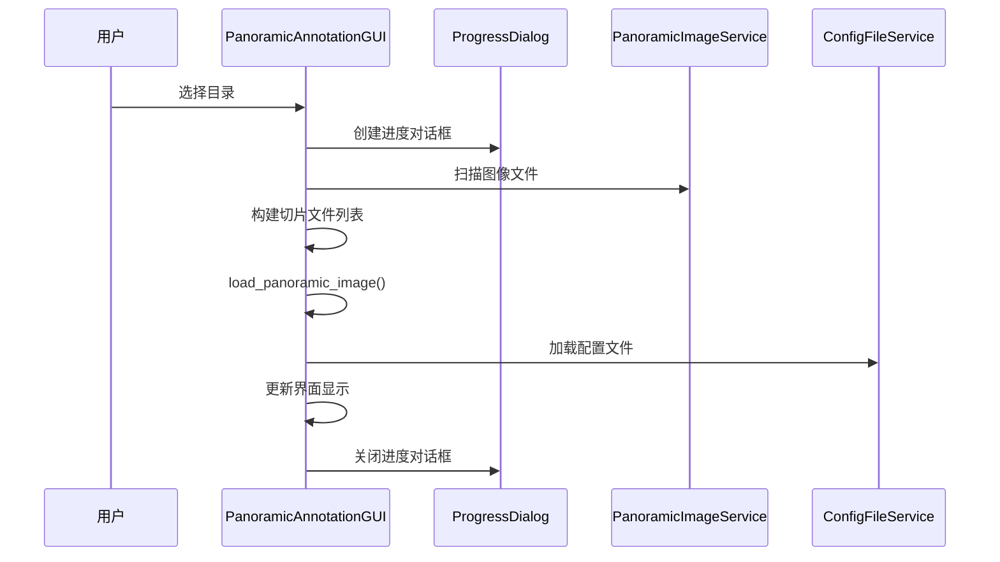
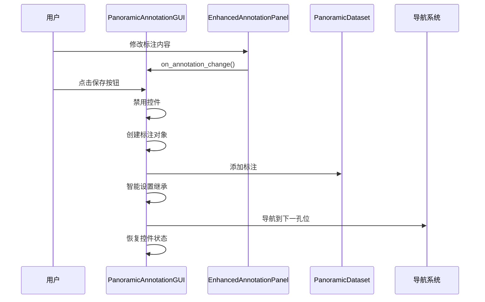
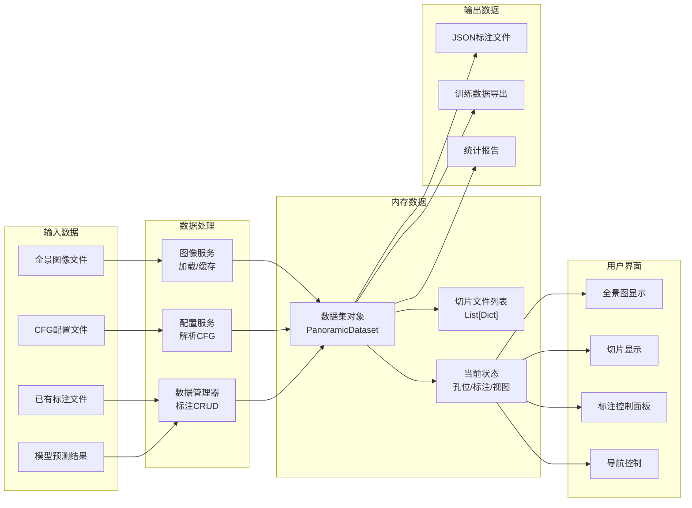
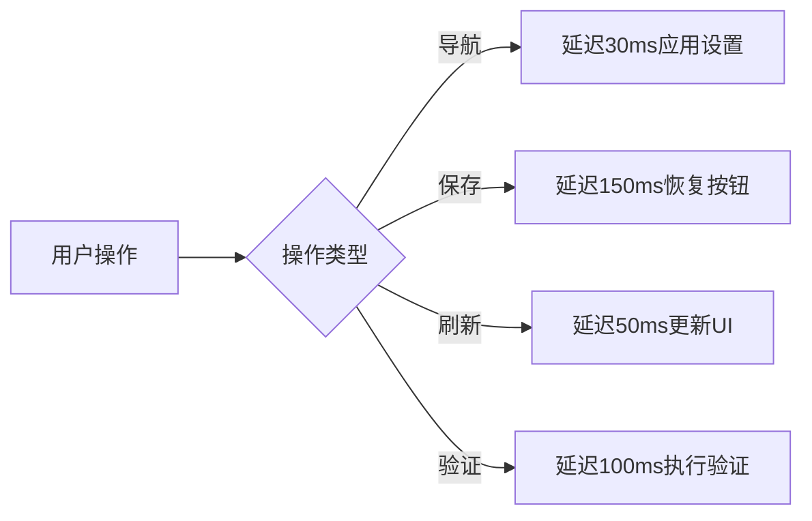

# 全景标注工具组件调用关系图

## 1. 核心类调用关系

```mermaid
graph TB
    subgraph "主界面层"
        PanoramicAnnotationGUI["PanoramicAnnotationGUI<br/>主控制器<br/>6398行"]
        ProgressDialog["ProgressDialog<br/>进度对话框"]
        ViewMode["ViewMode<br/>视图模式枚举"]
    end
    
    subgraph "UI组件层"
        HoleManager["HoleManager<br/>孔位管理器"]
        HoleConfigPanel["HoleConfigPanel<br/>孔位配置面板"]
        EnhancedAnnotationPanel["EnhancedAnnotationPanel<br/>增强标注面板"]
        BatchImportDialog["BatchImportDialog<br/>批量导入对话框"]
    end
    
    subgraph "服务层"
        PanoramicImageService["PanoramicImageService<br/>图像服务"]
        ConfigFileService["ConfigFileService<br/>配置文件服务"]
        ModelSuggestionService["ModelSuggestionImportService<br/>模型建议服务"]
    end
    
    subgraph "数据模型层"
        PanoramicAnnotation["PanoramicAnnotation<br/>标注数据模型"]
        PanoramicDataset["PanoramicDataset<br/>数据集模型"]
        EnhancedAnnotation["EnhancedPanoramicAnnotation<br/>增强标注模型"]
    end
    
    subgraph "工具层"
        Logger["Logger<br/>日志工具"]
        Version["Version<br/>版本管理"]
    end
    
    %% 主要调用关系
    PanoramicAnnotationGUI --> HoleManager
    PanoramicAnnotationGUI --> HoleConfigPanel
    PanoramicAnnotationGUI --> EnhancedAnnotationPanel
    PanoramicAnnotationGUI --> BatchImportDialog
    PanoramicAnnotationGUI --> ProgressDialog
    
    PanoramicAnnotationGUI --> PanoramicImageService
    PanoramicAnnotationGUI --> ConfigFileService
    PanoramicAnnotationGUI --> ModelSuggestionService
    
    PanoramicAnnotationGUI --> PanoramicAnnotation
    PanoramicAnnotationGUI --> PanoramicDataset
    PanoramicAnnotationGUI --> EnhancedAnnotation
    
    PanoramicAnnotationGUI --> Logger
    PanoramicAnnotationGUI --> Version
    
    %% 组件间调用
    EnhancedAnnotationPanel --> EnhancedAnnotation
    HoleConfigPanel --> ViewMode
    BatchImportDialog --> PanoramicAnnotation
    
    %% 服务层调用
    PanoramicImageService --> Logger
    ConfigFileService --> Logger
    ModelSuggestionService --> Logger
```



## 2. 方法调用流程图

### 2.1 应用启动流程


### 2.2 数据加载流程


### 2.3 标注保存流程


## 3. 数据流向图



## 4. 核心模块职责矩阵

| 模块 | 界面渲染 | 数据管理 | 用户交互 | 业务逻辑 | 文件IO |
|------|----------|----------|----------|----------|--------|
| **PanoramicAnnotationGUI** | ✅ 主控 | ✅ 协调 | ✅ 主控 | ✅ 核心 | ❌ |
| **EnhancedAnnotationPanel** | ✅ 局部 | ❌ | ✅ 局部 | ✅ 标注 | ❌ |
| **HoleManager** | ❌ | ✅ 孔位 | ❌ | ✅ 计算 | ❌ |
| **PanoramicImageService** | ❌ | ✅ 图像 | ❌ | ✅ 处理 | ✅ 图像 |
| **ConfigFileService** | ❌ | ✅ 配置 | ❌ | ✅ 解析 | ✅ 配置 |
| **PanoramicDataset** | ❌ | ✅ 标注 | ❌ | ✅ CRUD | ✅ JSON |

## 5. 事件处理机制

### 5.1 键盘事件映射
```python
键盘快捷键映射表:
├── 方向导航
│   ├── ← → ↑ ↓  → 孔位方向导航
│   ├── Home/End  → 首个/最后孔位
│   └── PageUp/PageDown → 全景图切换
├── 功能快捷键
│   ├── F1 → 显示帮助
│   ├── Ctrl+L → 窗口调整日志
│   ├── Space → 快速操作
│   └── Enter → 确认操作
└── 数字键
    ├── 1,2,3 → 快速设置选项
    └── 输入框焦点时禁用
```

### 5.2 鼠标事件处理
```python
鼠标事件处理:
├── 全景图点击 → on_panoramic_click()
│   └── 计算孔位坐标 → 跳转对应孔位
├── 界面拖拽 → 窗口布局调整
└── 控件交互 → 标准tkinter事件
```

### 5.3 回调事件系统
```python
回调事件注册机制:
├── 视图模式变更
│   ├── add_view_change_callback()
│   └── 通知所有注册的监听器
├── 标注内容变更
│   ├── on_annotation_change()
│   └── 实时更新显示和状态
└── 导航事件
    ├── 孔位切换回调
    └── 全景图切换回调
```

## 6. 性能优化策略

### 6.1 延迟加载机制


### 6.2 缓存策略
```python
缓存层次结构:
├── 图像缓存
│   ├── 全景图缓存 (当前+前后各1张)
│   └── 切片图缓存 (当前孔位)
├── 配置缓存
│   ├── CFG文件解析结果
│   └── 标注数据索引
└── UI状态缓存
    ├── 控件状态快照
    └── 布局参数缓存
```

---

*调用关系图生成时间: 2025年9月12日*
