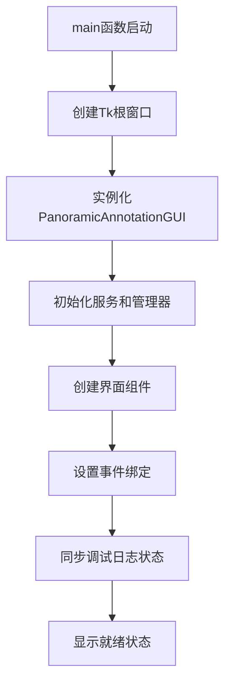
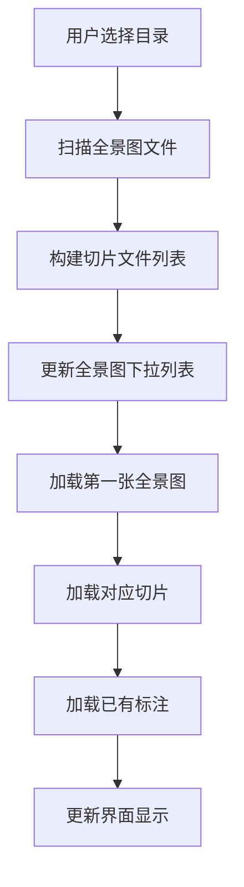
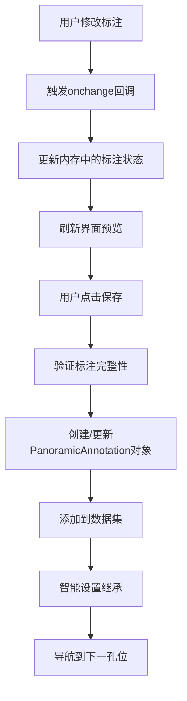
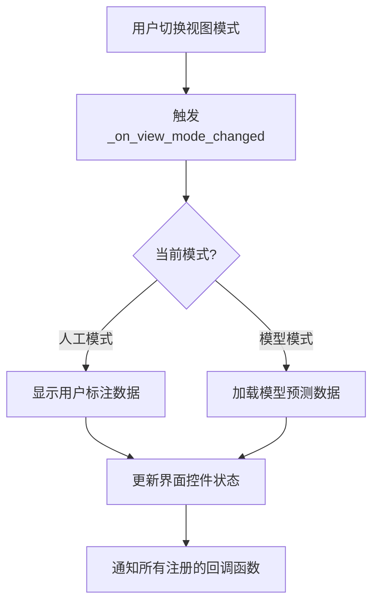

# 全景图像标注工具架构文档

## 文档概述
本文档详细描述了 `panoramic_annotation_gui.py` 及其关联代码的架构设计、调用关系和功能用途。

---

## 1. 核心架构概览

### 1.1 主要组件
```
panoramic_annotation_gui.py (6398行)
├── 主界面类 PanoramicAnnotationGUI
├── 进度对话框类 ProgressDialog  
├── 视图模式枚举 ViewMode
└── 模型建议服务占位符 ModelSuggestionImportService
```

### 1.2 依赖关系图
```
panoramic_annotation_gui.py
├── UI组件依赖
│   ├── src.ui.hole_manager → 孔位管理器
│   ├── src.ui.hole_config_panel → 孔位配置面板
│   ├── src.ui.enhanced_annotation_panel → 增强标注面板
│   └── src.ui.batch_import_dialog → 批量导入对话框
├── 服务层依赖
│   ├── src.services.panoramic_image_service → 全景图像服务
│   └── src.services.config_file_service → 配置文件服务
├── 数据模型依赖
│   ├── src.models.panoramic_annotation → 全景标注数据模型
│   └── src.models.enhanced_annotation → 增强标注数据模型
└── 工具类依赖
    ├── src.utils.logger → 日志工具
    └── src.utils.version → 版本管理
```

---

## 2. 主要类详细分析

### 2.1 PanoramicAnnotationGUI 类

#### 核心职责
- **主界面管理**: 创建和管理整个GUI界面布局
- **数据流控制**: 协调各个组件间的数据交互
- **用户交互**: 处理用户操作和事件响应
- **状态管理**: 维护应用程序的全局状态

#### 关键属性
```python
# 服务和管理器
self.image_service: PanoramicImageService     # 图像处理服务
self.hole_manager: HoleManager                # 孔位管理器  
self.config_service: ConfigFileService        # 配置文件服务
self.model_suggestion_service: ModelSuggestionImportService  # 模型建议服务

# 数据管理
self.current_dataset: PanoramicDataset        # 当前数据集
self.slice_files: List[Dict[str, Any]]       # 切片文件列表
self.current_slice_index: int                # 当前切片索引
self.current_panoramic_id: str               # 当前全景图ID
self.current_hole_number: int                # 当前孔位号

# UI状态
self.current_view_mode: ViewMode             # 当前视图模式
self.panoramic_image: Optional[Image.Image]  # 全景图像
self.slice_image: Optional[Image.Image]      # 切片图像
```

#### 主要方法分类

##### A. 界面构建方法
```python
def create_widgets()           # 创建主界面组件
def create_toolbar()           # 创建工具栏
def create_panoramic_panel()   # 创建全景图显示面板
def create_slice_panel()       # 创建切片显示面板
def create_navigation_panel()  # 创建导航控制面板
def create_annotation_panel()  # 创建标注控制面板
def create_status_bar()        # 创建状态栏
```

##### B. 数据加载方法
```python
def load_data()                    # 加载全景图数据
def load_current_slice()          # 加载当前切片
def load_panoramic_image()        # 加载全景图像
def load_existing_annotation()    # 加载已有标注
def load_config_annotations()     # 加载配置文件标注
```

##### C. 导航控制方法
```python
def go_first_hole()        # 跳转到第一个孔位
def go_last_hole()         # 跳转到最后一个孔位  
def go_prev_hole()         # 上一个孔位
def go_next_hole()         # 下一个孔位
def navigate_to_hole()     # 导航到指定孔位
def go_prev_panoramic()    # 上一张全景图
def go_next_panoramic()    # 下一张全景图
```

##### D. 标注操作方法
```python
def save_current_annotation()     # 保存当前标注
def skip_current()               # 跳过当前孔位
def clear_current_annotation()   # 清除当前标注
def batch_import_annotations()   # 批量导入标注
def import_model_suggestions()   # 导入模型建议
```

##### E. 事件处理方法
```python
def setup_bindings()           # 设置键盘快捷键
def on_panoramic_click()       # 全景图点击事件
def on_enhanced_annotation_change()  # 增强标注变化事件
def on_view_mode_changed()     # 视图模式变更事件
```

### 2.2 ProgressDialog 类

#### 用途
提供模态进度对话框，用于长时间操作的进度显示。

#### 主要功能
- 显示进度条和百分比
- 模态窗口阻止用户其他操作
- 自动居中显示
- 动态更新进度和消息

#### 关键方法
```python
def __init__()           # 初始化对话框
def center_window()      # 窗口居中
def create_widgets()     # 创建界面组件
def update_progress()    # 更新进度
def close()             # 关闭对话框
```

### 2.3 ViewMode 枚举

#### 定义
```python
class ViewMode(Enum):
    MANUAL = "人工"      # 人工标注模式
    MODEL = "模型"       # 模型预测模式
```

#### 用途
- 控制界面显示模式
- 决定标注数据来源和展示方式
- 影响用户交互行为

---

## 3. 关联组件分析

### 3.1 UI组件层

#### HoleManager (孔位管理器)
```python
# 位置: src/ui/hole_manager.py
# 职责: 管理12×10孔位布局的坐标转换和验证
# 主要方法:
- position_to_number()    # 坐标转孔位号
- number_to_position()    # 孔位号转坐标
- validate_hole_number()  # 验证孔位号有效性
- get_adjacent_holes()    # 获取相邻孔位
```

#### HoleConfigPanel (孔位配置面板)
```python
# 位置: src/ui/hole_config_panel.py
# 职责: 提供孔位参数配置界面
# 功能: 起始孔位设置、批量配置等
# 集成: 嵌入到主界面右侧面板
```

#### EnhancedAnnotationPanel (增强标注面板)
```python
# 位置: src/ui/enhanced_annotation_panel.py
# 职责: 提供增强的标注控制界面
# 功能: 
- 微生物类型选择
- 生长级别设置
- 干扰因素标记
- 特征组合管理
# 回调: on_annotation_change 通知主界面
```

### 3.2 服务层

#### PanoramicImageService (全景图像服务)
```python
# 位置: src/services/panoramic_image_service.py
# 职责: 全景图像的加载、处理和缓存
# 功能:
- 图像文件加载和格式转换
- 图像尺寸调整和优化
- 切片图像提取
- 图像缓存管理
```

#### ConfigFileService (配置文件服务)
```python
# 位置: src/services/config_file_service.py  
# 职责: 配置文件的读取和解析
# 功能:
- CFG配置文件解析
- 标注数据提取
- 配置缓存管理
- 格式标准化
```

### 3.3 数据模型层

#### PanoramicAnnotation & PanoramicDataset
```python
# 位置: src/models/panoramic_annotation.py
# 职责: 标注数据的结构化存储和管理
# 核心类:
class PanoramicAnnotation:
    - image_path: str           # 图像路径
    - label: str               # 标注标签  
    - bbox: List[int]          # 边界框坐标
    - confidence: float        # 置信度
    - microbe_type: str        # 微生物类型
    - growth_level: str        # 生长级别
    - interference_factors: List[str]  # 干扰因素
    
class PanoramicDataset:
    - name: str                # 数据集名称
    - annotations: List[PanoramicAnnotation]  # 标注列表
```

#### EnhancedPanoramicAnnotation
```python
# 位置: src/models/enhanced_annotation.py
# 职责: 增强标注功能的数据模型
# 扩展功能:
- FeatureCombination      # 特征组合
- 更详细的属性标记
- 模型预测结果集成
```

---

## 4. 数据流和交互流程

### 4.1 应用启动流程


### 4.2 数据加载流程


### 4.3 标注操作流程


### 4.4 视图模式切换流程


---

## 5. 关键特性和机制

### 5.1 智能设置继承
**目的**: 提高标注效率，减少重复操作

**策略**:
1. **模型视图优先**: 优先使用模型预测结果
2. **用户标注保持**: 已有人工标注不被覆盖
3. **CFG配置匹配**: 根据配置文件生长级别决定是否复制设置
4. **默认值回退**: 无配置时使用合理默认值

**实现方法**:
```python
def _apply_smart_inheritance_strategy(self, current_settings, next_hole_info, view_mode):
    # 复杂的策略判断逻辑
    # 考虑视图模式、已有标注、CFG配置等多个因素
```

### 5.2 性能监控系统
**目的**: 优化用户体验，减少界面卡顿

**监控指标**:
- 设置应用耗时
- UI加载时间  
- 按钮响应时间
- 详细步骤计时

**配置系统**:
```python
self.delay_config = {
    'settings_apply': 30,     # 设置应用延迟
    'button_recovery': 150,   # 按钮恢复延迟
    'quick_recovery': 100,    # 快速操作恢复
    'ui_refresh': 50,         # UI刷新延迟
    'verification': 100       # 验证延迟
}
```

### 5.3 多视图模式支持
**人工模式**: 
- 用户完全手动标注
- 提供智能设置继承
- 显示CFG配置参考

**模型模式**:
- 显示模型预测结果
- 支持预测结果确认/修正
- 模型置信度可视化

### 5.4 键盘快捷键系统
**导航快捷键**:
- `←→↑↓`: 方向导航
- `Home/End`: 首个/最后孔位
- `PageUp/PageDown`: 上一张/下一张全景图

**功能快捷键**:
- `F1`: 显示操作指南
- `Ctrl+L`: 分析窗口调整日志
- `Space/Enter`: 快速操作

---

## 6. 扩展点和插件机制

### 6.1 视图模式扩展
**设计**: 通过ViewMode枚举和回调机制支持新的视图模式

**扩展方式**:
```python
# 添加新的视图模式
class ViewMode(Enum):
    MANUAL = "人工"
    MODEL = "模型"
    CUSTOM = "自定义"  # 新增模式

# 注册视图变更回调
self.add_view_change_callback(custom_view_handler)
```

### 6.2 标注面板扩展
**设计**: 通过组合模式支持不同类型的标注面板

**当前支持**:
- 基础标注面板 (内置)
- 增强标注面板 (EnhancedAnnotationPanel)

**扩展方式**: 实现相同的回调接口即可集成新面板

### 6.3 服务层扩展
**图像服务扩展**: 支持新的图像格式和处理算法
**配置服务扩展**: 支持新的配置文件格式
**模型服务扩展**: 支持不同的AI模型集成

---

## 7. 配置和环境

### 7.1 依赖库
```python
# 核心GUI框架
tkinter + ttk          # 主界面框架

# 图像处理
PIL (Pillow)          # 图像加载和处理

# 数据处理  
json                  # 配置和标注数据序列化
pathlib               # 路径处理
typing                # 类型注解
enum                  # 枚举类型
```

### 7.2 文件组织
```
src/ui/panoramic_annotation_gui.py     # 主文件 (6398行)
├── 主要类和辅助类定义
├── 界面构建逻辑
├── 事件处理系统  
├── 数据管理逻辑
└── 性能优化代码
```

### 7.3 配置项
**窗口设置**:
- 默认尺寸: 1600×900
- 最小尺寸: 1400×800
- 自适应布局支持

**性能设置**:
- 可配置的延迟参数
- 可选的性能监控
- 调试日志开关

---

## 8. 开发和维护建议

### 8.1 代码组织建议
**当前状态**: 主文件过大 (6398行)，建议拆分

**推荐拆分方案**:
```
panoramic_annotation_gui/
├── main_gui.py           # 主界面类 (1000-1500行)
├── event_handlers.py     # 事件处理 (500-800行)  
├── data_manager.py       # 数据管理 (800-1000行)
├── ui_builders.py        # 界面构建 (1000行)
├── navigation_controller.py  # 导航控制 (500行)
└── performance_monitor.py    # 性能监控 (300行)
```

### 8.2 扩展开发指南
**添加新功能**:
1. 确定功能属于哪个层次 (UI/服务/数据)
2. 检查是否可以复用现有组件
3. 设计合适的接口和回调机制
4. 考虑性能影响和用户体验

**修改现有功能**:
1. 理解相关的数据流和调用关系
2. 注意向后兼容性
3. 更新相关的配置和文档
4. 进行充分测试

### 8.3 性能优化建议
**UI响应性**:
- 使用异步加载大型数据
- 合理使用延迟更新机制
- 避免频繁的界面重绘

**内存管理**:
- 图像缓存策略优化
- 及时释放不需要的资源
- 监控内存使用情况

---

## 9. 总结

`panoramic_annotation_gui.py` 是整个全景图像标注工具的核心控制器，它通过精心设计的架构协调了UI显示、数据管理、用户交互等多个方面的功能。虽然当前文件较大，但其模块化的内部结构为未来的重构和扩展提供了良好的基础。

该架构的主要优势：
- **职责分离**: 清晰的分层设计
- **可扩展性**: 插件化的组件机制
- **用户体验**: 智能化的操作辅助
- **性能优化**: 细致的性能监控和调优

建议的改进方向：
- **模块化拆分**: 将主文件拆分为多个专门的模块
- **异步处理**: 引入异步机制处理耗时操作
- **单元测试**: 为关键组件添加测试覆盖
- **文档完善**: 补充详细的API文档和使用指南

---

*文档生成时间: 2025年9月12日*
*基于版本: panoramic_annotation_gui.py (6398行)*
